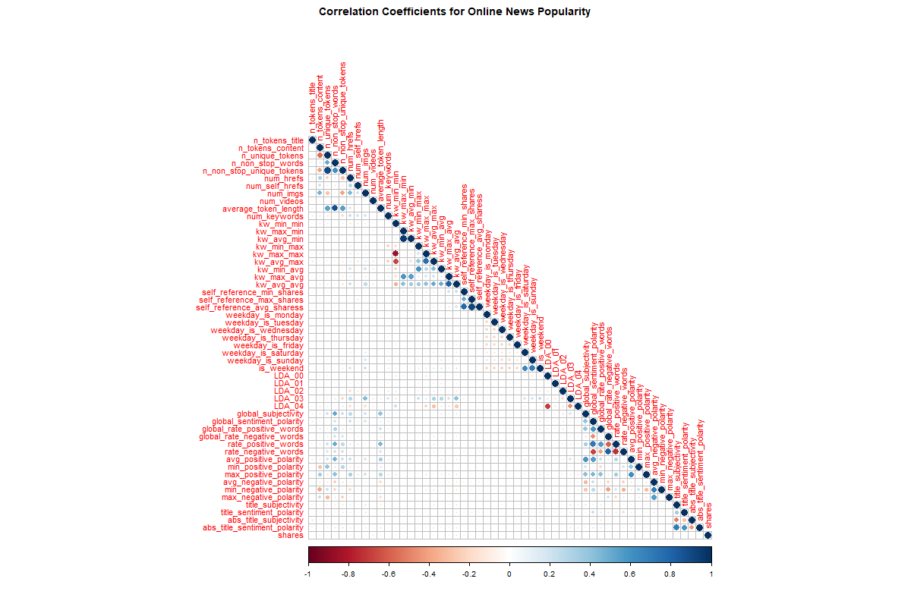
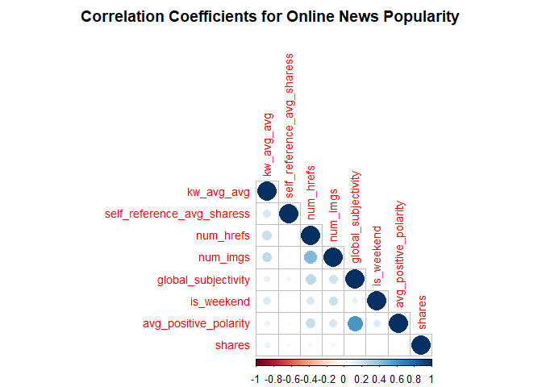
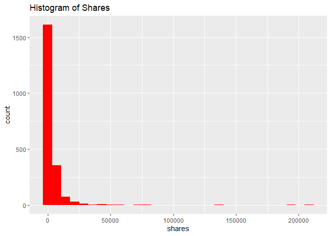
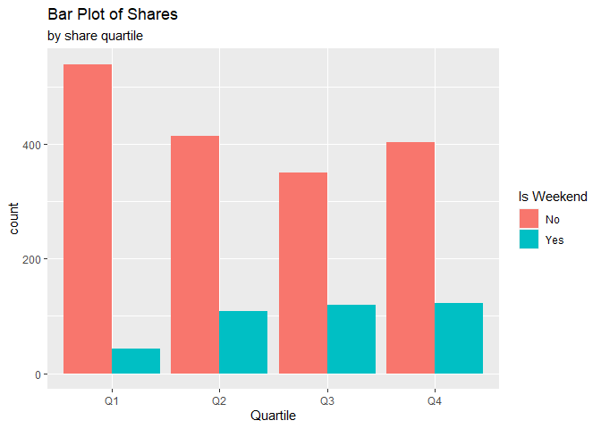
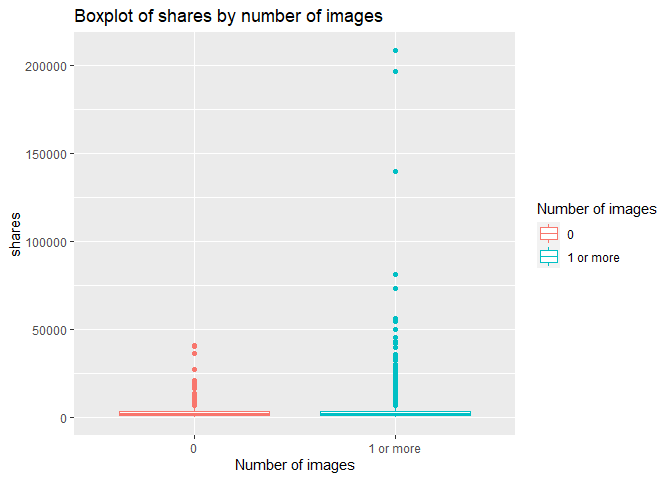
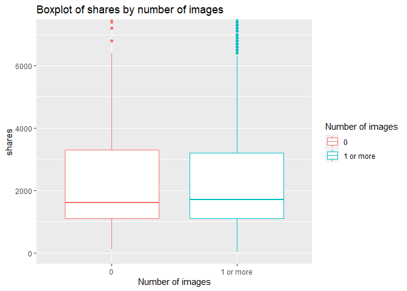
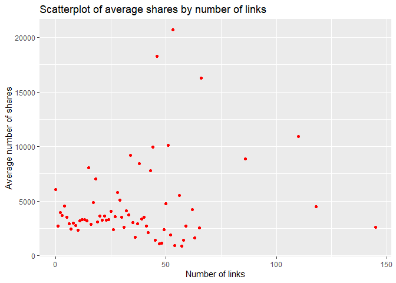
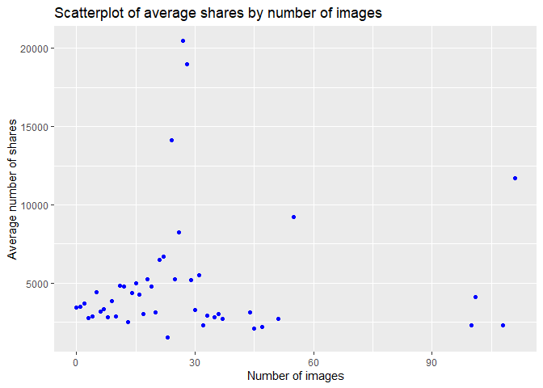

Project 3
================
Umesh Rao & Luke Perkins
2022-11-11

-   <a href="#introduction" id="toc-introduction">Introduction</a>
-   <a href="#data-reading-and-formatting"
    id="toc-data-reading-and-formatting">Data Reading and Formatting</a>
-   <a href="#r-markdown-automating" id="toc-r-markdown-automating">R
    Markdown Automating</a>
-   <a href="#summarizing" id="toc-summarizing">Summarizing</a>
    -   <a href="#correlations" id="toc-correlations">Correlations</a>
    -   <a href="#histogram" id="toc-histogram">Histogram</a>
    -   <a href="#contingency-table" id="toc-contingency-table">Contingency
        Table</a>
    -   <a href="#bar-plot" id="toc-bar-plot">Bar plot</a>
    -   <a href="#box-plot" id="toc-box-plot">Box plot</a>
    -   <a href="#scatter-plot" id="toc-scatter-plot">Scatter plot</a>
-   <a href="#modeling" id="toc-modeling">Modeling</a>
    -   <a href="#regression" id="toc-regression">Regression</a>
    -   <a href="#ensemble-tree-methods" id="toc-ensemble-tree-methods">Ensemble
        Tree Methods</a>
        -   <a href="#random-forest" id="toc-random-forest">Random Forest</a>
        -   <a href="#boosted-trees" id="toc-boosted-trees">Boosted Trees</a>
-   <a href="#comparing-models" id="toc-comparing-models">Comparing
    Models</a>

# Introduction

# Data Reading and Formatting

To begin, we load in relevant packages with `library()` statements.
Then, `read_csv()` and a relative path is used to read in the data.
`pivot_longer()` is used to reshape the six dummy variables indicating
the data channel into one column. The `cols` argument specifies the data
to restructure from rows to columns, `names_to` names the column
containing the column names from the original data, and `values_to`
names the column containing the actual values being reshaped. `filter()`
is then used to subset the data to only rows where the reshaped values
are 1, as in the ‘long’ data format, those are the only rows of
interest. The `temp` variable containing the indicator values is then
dropped and the object is saved.

``` r
library(tidyverse)
library(caret)
library(corrplot)
library(randomForest)
library(gbm)

news_pop <- read_csv("OnlineNewsPopularity.csv") %>%
  pivot_longer(cols = 14:19, 
               names_to = "data_channel", 
               values_to = "temp") %>%
  filter(temp == 1) %>%
  select(-temp)
```

# R Markdown Automating

The R Markdown is automated by generating separate reports and analyses
by each level of a parameter, in this case, the `data_channel`. First,
the `unique()` function is used to generate a list of unique values for
`data_channel`. Then, `paste0` concatenates the file extension to the
end of each channel ID. `lapply()` takes each concatenated name and
extension, and applies the `list` function to convert each one into a
named list object with one element. A tibble is then created containing
the the output file name and the one item list of the parameterized
`data_channel` value. The full data set `news_pop` then uses `filter()`
to subset records to the `data_channel` variable currently reflected in
the `params` argument in the R Markdown document, and is saved as
`channel`.

``` r
channelIDs <- unique(news_pop$data_channel)
output_file <- paste0(channelIDs, ".md")
param_names <- lapply(channelIDs, FUN = function(x){list(channel = x)})
reports <- tibble(output_file, param_names)
channel <- news_pop %>% filter(data_channel == params$channel)
```

# Summarizing

## Correlations

One strategy in exploring the data is to use a correlation matrix to
view potential linear relationships as a baseline. Using `select()`, the
full data set is subset to drop `url`, `timedelta`, which is indicated
in the variable descriptions as non-predictive, and `data_channel`, as
each analysis is split on the level of this variable, so the values will
all be the same. The `cor()` function creates a correlation matrix using
the Pearson correlation coefficient, and the matrix is saved as
`cor_mat`.

Because the number of variables is large, the `png()` function is called
to adjust the `width` and `height` of the correlation plot, and the file
is saved as a concatenation of the channel name, accessed with `params`,
and “corrplot.png”. The `corr_plot()` function is used to create a
visualization of the matrix, taking the matrix itself as the first
argument. The `type` argument is given as `"lower"` to indicate the
display should be the lower half, `tl.pos` as `"ld"` specifies the text
label positions as left and diagonal, `title` is used to give a relevant
title, and `mar` adjusts the margins so that the title is visible. The
`dev.off()` function closes the graphics device so that the image can
render, and `include_graphics()` prints the plot image.

``` r
summary(channel)
```

    ##      url              timedelta     n_tokens_title  
    ##  Length:2099        Min.   :  8.0   Min.   : 3.000  
    ##  Class :character   1st Qu.:203.0   1st Qu.: 8.000  
    ##  Mode  :character   Median :414.0   Median :10.000  
    ##                     Mean   :403.9   Mean   : 9.766  
    ##                     3rd Qu.:615.0   3rd Qu.:11.000  
    ##                     Max.   :731.0   Max.   :18.000  
    ##  n_tokens_content n_unique_tokens  n_non_stop_words
    ##  Min.   :   0.0   Min.   :0.0000   Min.   :0.0000  
    ##  1st Qu.: 308.5   1st Qu.:0.4629   1st Qu.:1.0000  
    ##  Median : 502.0   Median :0.5197   Median :1.0000  
    ##  Mean   : 621.3   Mean   :0.5236   Mean   :0.9895  
    ##  3rd Qu.: 795.0   3rd Qu.:0.5906   3rd Qu.:1.0000  
    ##  Max.   :8474.0   Max.   :0.8681   Max.   :1.0000  
    ##  n_non_stop_unique_tokens   num_hrefs     
    ##  Min.   :0.0000           Min.   :  0.00  
    ##  1st Qu.:0.6275           1st Qu.:  6.00  
    ##  Median :0.6841           Median : 10.00  
    ##  Mean   :0.6834           Mean   : 13.42  
    ##  3rd Qu.:0.7524           3rd Qu.: 18.00  
    ##  Max.   :1.0000           Max.   :145.00  
    ##  num_self_hrefs      num_imgs         num_videos    
    ##  Min.   : 0.000   Min.   :  0.000   Min.   : 0.000  
    ##  1st Qu.: 1.000   1st Qu.:  1.000   1st Qu.: 0.000  
    ##  Median : 2.000   Median :  1.000   Median : 0.000  
    ##  Mean   : 2.516   Mean   :  4.905   Mean   : 0.475  
    ##  3rd Qu.: 3.000   3rd Qu.:  8.000   3rd Qu.: 0.000  
    ##  Max.   :40.000   Max.   :111.000   Max.   :50.000  
    ##  average_token_length  num_keywords     kw_min_min    
    ##  Min.   :0.000        Min.   : 3.00   Min.   : -1.00  
    ##  1st Qu.:4.445        1st Qu.: 7.00   1st Qu.: -1.00  
    ##  Median :4.621        Median : 8.00   Median :  4.00  
    ##  Mean   :4.588        Mean   : 8.23   Mean   : 40.59  
    ##  3rd Qu.:4.794        3rd Qu.:10.00   3rd Qu.:  4.00  
    ##  Max.   :5.947        Max.   :10.00   Max.   :377.00  
    ##    kw_max_min        kw_avg_min        kw_min_max    
    ##  Min.   :    0.0   Min.   :   -1.0   Min.   :     0  
    ##  1st Qu.:  502.5   1st Qu.:  185.2   1st Qu.:     0  
    ##  Median :  816.0   Median :  301.2   Median :     0  
    ##  Mean   : 1609.1   Mean   :  410.5   Mean   :  7288  
    ##  3rd Qu.: 1300.0   3rd Qu.:  447.4   3rd Qu.:  6400  
    ##  Max.   :98700.0   Max.   :14187.8   Max.   :208300  
    ##    kw_max_max       kw_avg_max       kw_min_avg  
    ##  Min.   :     0   Min.   :     0   Min.   :   0  
    ##  1st Qu.:690400   1st Qu.:118993   1st Qu.:   0  
    ##  Median :843300   Median :182100   Median :   0  
    ##  Mean   :704125   Mean   :183808   Mean   :1069  
    ##  3rd Qu.:843300   3rd Qu.:249900   3rd Qu.:2285  
    ##  Max.   :843300   Max.   :538744   Max.   :3610  
    ##    kw_max_avg      kw_avg_avg   
    ##  Min.   :    0   Min.   :    0  
    ##  1st Qu.: 4071   1st Qu.: 2644  
    ##  Median : 5051   Median : 3239  
    ##  Mean   : 6668   Mean   : 3419  
    ##  3rd Qu.: 7226   3rd Qu.: 3945  
    ##  Max.   :98700   Max.   :20378  
    ##  self_reference_min_shares self_reference_max_shares
    ##  Min.   :     0            Min.   :     0           
    ##  1st Qu.:   562            1st Qu.:   887           
    ##  Median :  1600            Median :  2700           
    ##  Mean   :  4570            Mean   :  8075           
    ##  3rd Qu.:  3700            3rd Qu.:  7100           
    ##  Max.   :144900            Max.   :690400           
    ##  self_reference_avg_sharess weekday_is_monday
    ##  Min.   :     0.0           Min.   :0.0000   
    ##  1st Qu.:   880.5           1st Qu.:0.0000   
    ##  Median :  2400.0           Median :0.0000   
    ##  Mean   :  6020.5           Mean   :0.1534   
    ##  3rd Qu.:  5500.0           3rd Qu.:0.0000   
    ##  Max.   :401450.0           Max.   :1.0000   
    ##  weekday_is_tuesday weekday_is_wednesday
    ##  Min.   :0.0000     Min.   :0.0000      
    ##  1st Qu.:0.0000     1st Qu.:0.0000      
    ##  Median :0.0000     Median :0.0000      
    ##  Mean   :0.1591     Mean   :0.1848      
    ##  3rd Qu.:0.0000     3rd Qu.:0.0000      
    ##  Max.   :1.0000     Max.   :1.0000      
    ##  weekday_is_thursday weekday_is_friday
    ##  Min.   :0.0000      Min.   :0.0000   
    ##  1st Qu.:0.0000      1st Qu.:0.0000   
    ##  Median :0.0000      Median :0.0000   
    ##  Mean   :0.1706      Mean   :0.1453   
    ##  3rd Qu.:0.0000      3rd Qu.:0.0000   
    ##  Max.   :1.0000      Max.   :1.0000   
    ##  weekday_is_saturday weekday_is_sunday   is_weekend    
    ##  Min.   :0.00000     Min.   :0.0       Min.   :0.0000  
    ##  1st Qu.:0.00000     1st Qu.:0.0       1st Qu.:0.0000  
    ##  Median :0.00000     Median :0.0       Median :0.0000  
    ##  Mean   :0.08671     Mean   :0.1       Mean   :0.1868  
    ##  3rd Qu.:0.00000     3rd Qu.:0.0       3rd Qu.:0.0000  
    ##  Max.   :1.00000     Max.   :1.0       Max.   :1.0000  
    ##      LDA_00            LDA_01            LDA_02       
    ##  Min.   :0.01818   Min.   :0.01819   Min.   :0.01819  
    ##  1st Qu.:0.02252   1st Qu.:0.02222   1st Qu.:0.02222  
    ##  Median :0.02913   Median :0.02508   Median :0.02534  
    ##  Mean   :0.17709   Mean   :0.06577   Mean   :0.07772  
    ##  3rd Qu.:0.24962   3rd Qu.:0.04001   3rd Qu.:0.06675  
    ##  Max.   :0.91980   Max.   :0.68825   Max.   :0.67623  
    ##      LDA_03            LDA_04        global_subjectivity
    ##  Min.   :0.01820   Min.   :0.02014   Min.   :0.0000     
    ##  1st Qu.:0.02246   1st Qu.:0.32231   1st Qu.:0.4246     
    ##  Median :0.02916   Median :0.57519   Median :0.4768     
    ##  Mean   :0.14495   Mean   :0.53447   Mean   :0.4732     
    ##  3rd Qu.:0.20618   3rd Qu.:0.79962   3rd Qu.:0.5254     
    ##  Max.   :0.91892   Max.   :0.92707   Max.   :0.8667     
    ##  global_sentiment_polarity global_rate_positive_words
    ##  Min.   :-0.3727           Min.   :0.00000           
    ##  1st Qu.: 0.1001           1st Qu.:0.03469           
    ##  Median : 0.1493           Median :0.04377           
    ##  Mean   : 0.1516           Mean   :0.04435           
    ##  3rd Qu.: 0.2050           3rd Qu.:0.05333           
    ##  Max.   : 0.5800           Max.   :0.12139           
    ##  global_rate_negative_words rate_positive_words
    ##  Min.   :0.00000            Min.   :0.0000     
    ##  1st Qu.:0.01023            1st Qu.:0.6625     
    ##  Median :0.01538            Median :0.7377     
    ##  Mean   :0.01633            Mean   :0.7226     
    ##  3rd Qu.:0.02106            3rd Qu.:0.8125     
    ##  Max.   :0.06180            Max.   :1.0000     
    ##  rate_negative_words avg_positive_polarity
    ##  Min.   :0.0000      Min.   :0.0000       
    ##  1st Qu.:0.1837      1st Qu.:0.3360       
    ##  Median :0.2581      Median :0.3847       
    ##  Mean   :0.2669      Mean   :0.3829       
    ##  3rd Qu.:0.3333      3rd Qu.:0.4341       
    ##  Max.   :1.0000      Max.   :0.7553       
    ##  min_positive_polarity max_positive_polarity
    ##  Min.   :0.00000       Min.   :0.0000       
    ##  1st Qu.:0.05000       1st Qu.:0.7000       
    ##  Median :0.10000       Median :0.9000       
    ##  Mean   :0.09482       Mean   :0.8276       
    ##  3rd Qu.:0.10000       3rd Qu.:1.0000       
    ##  Max.   :0.50000       Max.   :1.0000       
    ##  avg_negative_polarity min_negative_polarity
    ##  Min.   :-1.0000       Min.   :-1.0000      
    ##  1st Qu.:-0.3206       1st Qu.:-0.7000      
    ##  Median :-0.2571       Median :-0.5000      
    ##  Mean   :-0.2631       Mean   :-0.5513      
    ##  3rd Qu.:-0.2000       3rd Qu.:-0.4000      
    ##  Max.   : 0.0000       Max.   : 0.0000      
    ##  max_negative_polarity title_subjectivity
    ##  Min.   :-1.0000       Min.   :0.0000    
    ##  1st Qu.:-0.1250       1st Qu.:0.0000    
    ##  Median :-0.1000       Median :0.1000    
    ##  Mean   :-0.1033       Mean   :0.2861    
    ##  3rd Qu.:-0.0500       3rd Qu.:0.5000    
    ##  Max.   : 0.0000       Max.   :1.0000    
    ##  title_sentiment_polarity abs_title_subjectivity
    ##  Min.   :-1.0000          Min.   :0.0000        
    ##  1st Qu.: 0.0000          1st Qu.:0.1721        
    ##  Median : 0.0000          Median :0.5000        
    ##  Mean   : 0.1091          Mean   :0.3473        
    ##  3rd Qu.: 0.2143          3rd Qu.:0.5000        
    ##  Max.   : 1.0000          Max.   :0.5000        
    ##  abs_title_sentiment_polarity     shares      
    ##  Min.   :0.0000               Min.   :    28  
    ##  1st Qu.:0.0000               1st Qu.:  1100  
    ##  Median :0.0000               Median :  1700  
    ##  Mean   :0.1733               Mean   :  3682  
    ##  3rd Qu.:0.2979               3rd Qu.:  3250  
    ##  Max.   :1.0000               Max.   :208300  
    ##  data_channel      
    ##  Length:2099       
    ##  Class :character  
    ##  Mode  :character  
    ##                    
    ##                    
    ## 

``` r
cor_mat <- channel %>% 
  select(-url, -data_channel, -timedelta) %>%
  cor()

png(filename = paste0(params$channel, "corrplot.png"), 
    width = 1200, height = 800)
corrplot(cor_mat,
         type = "lower",
         tl.pos = "ld",
         tl.cex = 0.9,
         mar = c(0, 0, 2, 0),
         title = "Correlation Coefficients for Online News Popularity",
)
dev.off()
```

    ## png 
    ##   2

``` r
knitr::include_graphics(paste0(params$channel, "corrplot.png"))
```

<!-- -->

Dark blue circles indicate there is a strong positive linear
relationship between the variables, dark red indicates a strong negative
linear relationship, and lighter shades of either color indicate weaker
linear relationships. From the plot, the strongest linear relationships
are between related variables, like each of the days of the week,
different measures of keywords, or measures of polarity. The rest of the
variables have weaker relationships, indicating there is little risk of
multicollinearity if variables from different subject matters are
chosen.

To aid in selection, a tibble of top correlations with the `shares`
variable is generated. First, the names of the variables are taken from
the correlation matrix using `row.names()`, then the values of the
correlations across all variables with respect to `shares` is taken by
using `bind_cols` and returning the `shares` column with index 53. The
values are then sorted with `arrange()`, in descending order with
`desc()`, and the top 20 rows are returned with `head()`. The tibble is
then printed for viewing.

In addition to using general knowledge about the content in variable
selection, variables are chosen from different subject matters to avoid
colinearity. So, from this list, one variable from each general area is
selected, in addition to the target variable, then the subset of the
data set is saved and a correlation matrix on the subset is printed as a
table using the `kable()` function.

Another correlation plot is generated on the smaller set of variables
using `corrplot()`, and the results should ideally confirm that the
variables are within acceptable ranges of correlation to each other.

``` r
top_cors <- cor_mat %>%
  row.names() %>%
  bind_cols("values" = cor_mat[ ,53]) %>%
  arrange(desc(values)) %>%
  head(n = 20)
top_cors
```

    ## # A tibble: 20 × 2
    ##    ...1                       values
    ##    <chr>                       <dbl>
    ##  1 shares                     1     
    ##  2 kw_avg_avg                 0.0915
    ##  3 num_videos                 0.0883
    ##  4 n_tokens_content           0.0730
    ##  5 self_reference_min_shares  0.0724
    ##  6 LDA_03                     0.0680
    ##  7 kw_max_avg                 0.0536
    ##  8 num_hrefs                  0.0536
    ##  9 num_imgs                   0.0512
    ## 10 self_reference_avg_sharess 0.0424
    ## 11 kw_max_max                 0.0368
    ## 12 weekday_is_monday          0.0318
    ## 13 kw_avg_max                 0.0314
    ## 14 abs_title_subjectivity     0.0312
    ## 15 global_rate_negative_words 0.0297
    ## 16 rate_negative_words        0.0251
    ## 17 weekday_is_tuesday         0.0230
    ## 18 kw_min_max                 0.0207
    ## 19 num_keywords               0.0197
    ## 20 self_reference_max_shares  0.0188

``` r
subset_channel <- channel %>%
  select(kw_avg_avg, self_reference_avg_sharess, num_hrefs, num_imgs, 
         global_subjectivity, is_weekend, avg_positive_polarity, shares)
knitr::kable(cor(subset_channel))
```

|                            | kw_avg_avg | self_reference_avg_sharess | num_hrefs |  num_imgs | global_subjectivity | is_weekend | avg_positive_polarity |    shares |
|:---------------------------|-----------:|---------------------------:|----------:|----------:|--------------------:|-----------:|----------------------:|----------:|
| kw_avg_avg                 |  1.0000000 |                  0.1600733 | 0.2261591 | 0.2541683 |           0.1036093 |  0.1505006 |             0.0845294 | 0.0915190 |
| self_reference_avg_sharess |  0.1600733 |                  1.0000000 | 0.0163725 | 0.0298623 |           0.0635351 | -0.0011668 |             0.0227486 | 0.0424044 |
| num_hrefs                  |  0.2261591 |                  0.0163725 | 1.0000000 | 0.4423336 |           0.2630175 |  0.1615772 |             0.2362372 | 0.0535864 |
| num_imgs                   |  0.2541683 |                  0.0298623 | 0.4423336 | 1.0000000 |           0.1992547 |  0.2147337 |             0.1758854 | 0.0512013 |
| global_subjectivity        |  0.1036093 |                  0.0635351 | 0.2630175 | 0.1992547 |           1.0000000 |  0.1152395 |             0.5826314 | 0.0177399 |
| is_weekend                 |  0.1505006 |                 -0.0011668 | 0.1615772 | 0.2147337 |           0.1152395 |  1.0000000 |             0.1431079 | 0.0126546 |
| avg_positive_polarity      |  0.0845294 |                  0.0227486 | 0.2362372 | 0.1758854 |           0.5826314 |  0.1431079 |             1.0000000 | 0.0090621 |
| shares                     |  0.0915190 |                  0.0424044 | 0.0535864 | 0.0512013 |           0.0177399 |  0.0126546 |             0.0090621 | 1.0000000 |

``` r
corrplot(cor(subset_channel),
         type = "lower",
         tl.pos = "ld",
         tl.cex = 0.9,
         mar = c(0, 0, 2, 0),
         title = "Correlation Coefficients for Online News Popularity",
)
```

<!-- -->

## Histogram

To look at some other summaries of the data, it may be useful to
consider the distribution of the response variable. First, five number
summaries of all of the variables of interest are taken with the
`summary()` function. Means greater than comparative medians could
indicate positive skew, and extremely large maximum values in relation
to the other percentiles could be a sign of heavy skew. Means lower than
comparative medians could indicate negative skew.

A histogram of the number of shares is generated with `ggplot()`. The
range of share values is mapped to the x axis via `aes()` argument, and
the base plotting object is saved. From the base object, a histogram
layer is added with `geom_histogram()`. The color is set to red via
`fill` argument, and a title is added using its respective argument in
the `labs()` layer. If the histogram is skewed to the right, that
indicates that most articles have fewer shares across the full range of
number of shares, and fewer articles have many shares. If the peak is in
the middle, it would indicate that most articles are in the middle of
the spectrum in terms of share counts, and if it the peak is on the
right, it indicates that most articles are highly shared and fewer are
less shared. Multiple peaks or modes could signify multiple populations.

``` r
summary(subset_channel)
```

    ##    kw_avg_avg    self_reference_avg_sharess
    ##  Min.   :    0   Min.   :     0.0          
    ##  1st Qu.: 2644   1st Qu.:   880.5          
    ##  Median : 3239   Median :  2400.0          
    ##  Mean   : 3419   Mean   :  6020.5          
    ##  3rd Qu.: 3945   3rd Qu.:  5500.0          
    ##  Max.   :20378   Max.   :401450.0          
    ##    num_hrefs         num_imgs       global_subjectivity
    ##  Min.   :  0.00   Min.   :  0.000   Min.   :0.0000     
    ##  1st Qu.:  6.00   1st Qu.:  1.000   1st Qu.:0.4246     
    ##  Median : 10.00   Median :  1.000   Median :0.4768     
    ##  Mean   : 13.42   Mean   :  4.905   Mean   :0.4732     
    ##  3rd Qu.: 18.00   3rd Qu.:  8.000   3rd Qu.:0.5254     
    ##  Max.   :145.00   Max.   :111.000   Max.   :0.8667     
    ##    is_weekend     avg_positive_polarity     shares      
    ##  Min.   :0.0000   Min.   :0.0000        Min.   :    28  
    ##  1st Qu.:0.0000   1st Qu.:0.3360        1st Qu.:  1100  
    ##  Median :0.0000   Median :0.3847        Median :  1700  
    ##  Mean   :0.1868   Mean   :0.3829        Mean   :  3682  
    ##  3rd Qu.:0.0000   3rd Qu.:0.4341        3rd Qu.:  3250  
    ##  Max.   :1.0000   Max.   :0.7553        Max.   :208300

``` r
g <- ggplot(data = subset_channel, aes(x = shares))
g + geom_histogram(fill = "red") +
  labs(title = "Histogram of Shares")
```

<!-- -->

## Contingency Table

It might be interesting to look at the number of shares depending on
whether the article was published on a weekend or not. To view the
`share` variable in another way, it can be divided along its quartiles
with the `cut()` function. Taking the `shares` variable as its first
argument, `cut()` then uses `quantile()` to split up the variable into
value ranges, taking a vector of quantiles with the `probs()` argument.
Labels of the ranges are assigned as the related quartiles with the
`labels` argument. Then, the object is saved and used in the `table()`
function to make a contingency table against the `is_weekend` variable.
`rbind()` takes the table and uses `apply()` to add the proportion of
number of weekend shares of the total split. The `MARGIN` argument is
set to 2 to indicate column proportions are being calculated, and the
`FUN` argument takes in the function to apply: in this case, the number
of weekend shares divided by the sum of shares for the split, rounded to
3 decimals. Proportions trending higher from left to right indicate that
it is more common for articles with higher shares to be published on a
weekend for that particular data channel relative to articles with lower
shares, and proportions trending lower from left to right indicate the
converse. If neither case is true, there may be no clear linear pattern.

``` r
quart_shares <- cut(subset_channel$shares, 
                    breaks = quantile(subset_channel$shares, 
                                      probs = c(0, 0.25, 0.5, 0.75, 1)),
                    labels = c("Q1", "Q2", "Q3", "Q4"))
tab <- table(subset_channel$is_weekend, quart_shares)
rbind(tab, apply(tab, MARGIN = 2, FUN = function(x){round(x[2] / sum(x), 3)}))
```

    ##        Q1      Q2      Q3      Q4
    ## 0 539.000 414.000 350.000 403.000
    ## 1  43.000 108.000 119.000 122.000
    ##     0.074   0.207   0.254   0.232

## Bar plot

The contingency table can be graphically visualized as a bar plot.
First, the data is subset to only the `is_weekend` variable, and the
factor of quartiles created previously with the `cut()` function is
added using `mutate()`. Then, the `drop_na()` function is used on the
quartiles to prevent an empty fill of `NA` in the bar plot, and the new
data set is saved as `bar_data`.

A base plotting object is then created with the subset `bar_data`,
mapping the quartiles to the x axis as an aesthetic within the `aes()`
function. A bar geom layer is added using `geom_bar()`, with
`is_weekend`, which is converted to a factor, mapped to the bar fills
using the `fill` argument within the `aes()` mapping. The `position`
argument is set to `"dodge"` to display the bar fills side-by-side.
Appropriate labels are then added with a `labs()` layer, setting the
title, subtitle, x axis, and fill labels with their respective
arguments. A final label is added with `scale_fill_discrete()`, changing
the fill labels in the legend from 0 and 1 to “No” and “Yes”.

From the plot, the same trends can be tracked. Differing fill heights
within a quartile will indicate whether articles published on a weekend
had more or less shares for that relative range of shares(the quartile),
and changes in height for the same fill across quartiles will indicate
if more articles are shared in higher volumes for that setting of
weekday vs. weekend. If the bars go up, then the number of articles that
are shared for higher share ranges increase; if the bars go down, then
the number of articles share for higher share ranges decrease, and if
the bars do neither, then there is no clear linear trend.

``` r
bar_data <- subset_channel %>%
  select(is_weekend) %>%
  mutate(quart_shares = quart_shares) %>%
  drop_na(quart_shares)

g <- ggplot(data = bar_data, aes(x = quart_shares))
g + geom_bar(aes(fill = as.factor(is_weekend)), 
             position = "dodge") +
  labs(title = "Bar Plot of Shares",
       subtitle = "by share quartile",
       x = "Quartile",
       fill = "Is Weekend") +
  scale_fill_discrete(labels = c("No", "Yes"))
```

<!-- -->

## Box plot

Another interesting grouping is to examine shares by the number of
images. Many articles do not use images at all, so it may be interesting
to contrast those that do with those that do not. The `cut()` function
is used to split the variable of interest again, this time from 0 to 1
or more. The `labels` argument is used to give labels for cleaner plots,
and `right` is set to `FALSE` to make the splits exclude the right
value, meaning 0 is the first split, and the second split starts at 1. A
base plotting object is created again, this time mapping the cut
variable `img_split` on the x axis, and the number of shares on the y
axis. A box plot layer is added with `geom_boxplot()`, mapping the split
levels as the color. Labels for the title, x axis, and legend are added
by arguments of `"title"`, `"x"`, and `"color"`, respectively, within
the `labs()` function.

Because the distribution of shares could be highly skewed, there may be
many outliers and the box plot may not be visually appealing or useful.
Although outliers should not be removed without cause, to gain a better
view of the data, a consideration may be to view the box plot without
them. A similar box plot with the same syntax, but adding a coordinate
layer with `coord_cartesian()` is generated, specifying the `ylim`
argument to range from 0 to the 90th percentile of `shares` to show a
better scale that hides some outliers. Many points above the boxes, a
long tail above the box plots, or the median line being located towards
the bottom of the boxes could indicate positive skew. Points towards the
bottom would, a long tail below the box plots, or the median line being
indicated towards the top of the boxes could indicate negative skew.
Relatively symmetric tails, a median close to the center of the boxes,
and few outliers would indicate a symmetric distribution.

``` r
img_split <- cut(subset_channel$num_imgs, 
                 breaks = c(0, 1, Inf),
                 labels = c("0", "1 or more"),
                 right = FALSE)
g <- ggplot(data = subset_channel, aes(x = img_split, y = shares))
g + geom_boxplot(aes(color = img_split)) +
  labs(title = "Boxplot of shares by number of images",
       x = "Number of images",
       color = "Number of images")
```

<!-- -->

``` r
g <- ggplot(data = subset_channel, aes(x = img_split, y = shares))
g + geom_boxplot(aes(color = img_split)) +
  labs(title = "Boxplot of shares by number of images",
       x = "Number of images",
       color = "Number of images") +
  coord_cartesian(ylim = c(0, quantile(subset_channel$shares, 0.90)))
```

<!-- -->

## Scatter plot

It may be interesting to consider the average number of shares across
variables. First, the data is summarized by using the `group_by`
function on `num_hrefs` to create a grouping by number of links, then,
the `summarize()` function calls the `mean()` function to take the
average number of shares across each value of the number of links. The
same idea is done to summarize the average number of shares across the
number of links, using the same syntax.

To create a scatter plot for the average shares by number of links, a
base plotting object is created with `ggplot()`, using the summarized
`avg_links` as the reference data set. A geom layer using `geom_point()`
maps the aesthetics of number of links on the x axis and average shares
on the y axis, and the `color` argument colors the points red. Then, a
label layer adds title, x axis, y axis labels. A scatter plot for the
average shares by number of links is added, using the same syntax, but
substituting the corresponding data set, variables, and labels.

When viewing the plots, a trend of points moving upwards from left to
right would indicate the average number of shares increases with the
number of links or images in articles, and a trend of points moving
downwards from right to left would indicate the average number of shares
decreases with the number of the number of links or images in articles.
Points having no general direction would indicate little or no trend in
linearity.

``` r
avg_links <- subset_channel %>%
  group_by(num_hrefs) %>%
  summarize(avg_shares = mean(shares))

avg_imgs <- subset_channel %>%
  group_by(num_imgs) %>%
  summarize(avg_shares = mean(shares))

g <- ggplot(data = avg_links)
g + geom_point(aes(x = num_hrefs, y = avg_shares), color = "red") +
  labs(title = "Scatterplot of average shares by number of links",
       x = "Number of links",
       y = "Average number of shares")
```

<!-- -->

``` r
g <- ggplot(data = avg_imgs)
g + geom_point(aes(x = num_imgs, y = avg_shares), color = "blue") +
  labs(title = "Scatterplot of average shares by number of images",
       x = "Number of images",
       y = "Average number of shares")
```

<!-- -->

# Modeling

## Regression

**Explanation**: Linear regression is a supervised learning technique
where the value of the of a response variable is modeled or predicted by
an explanatory variable by fitting a linear equation to observed data.
The equation of the line can be modeled generically by:
`Y~i~ = B~0~ + B~1~x~i~ + E~i~ where Y~i~` is the response for the
i<sup>th</sup> observation, `x~i~` is the value of the explanatory
variable for the i<sup>th</sup> observation, `B~0~` is the y-intercept,
`B~1~` is the slope, and `E~i~` is the error. The line of best fit is
found by minimizing the sum of squared differences between the observed
values and the predicted values on the line itself.

To model the data, first it needs to be split into a training set and
test set. The `createDataPartition()` takes the `shares` variable and
samples 70% of the indices by passing 0.7 to the `p` argument, and
lastly, outputs the results as a matrix by setting the `list` argument
to `FALSE`. The indices are saved and used to subset the data set on the
variables of interest by using the `[` function and accessing the
indices as the rows. The training set is saved, and the same method is
used to obtain a test set, but using the `-` function to access the
indices that were not sampled.

The `train()` function fits a multiple linear regression model of
`shares`, modeled by the remaining main effect terms of the variables
chosen during the correlation section above. The data used is the
training set, and the `method` argument is passed “lm” to indicate a
linear model. The model is saved as `mlr`.

A second multiple linear regression model is fitted using the same
methodology and syntax, but uses all main effects and all interaction
terms via `~.^2` in the formula argument.

``` r
dataIndex <- createDataPartition(subset_channel$shares, p = 0.7, list = FALSE)
dataTrain <- subset_channel[dataIndex, ]
dataTest <- subset_channel[-dataIndex, ]

mlr <- train(shares ~., data = dataTrain, method ="lm")
mlr2<- train(shares ~.^2, data = dataTrain, method ="lm")
```

## Ensemble Tree Methods

### Random Forest

**Explanation:** A random forest model is an ensemble learning method
where many trees are fitted and their results are averaged. The basic
concept is that given a sample, that sample is resampled in the same
manner as the original repeatedly. The samples are taken with
replacement, so that duplicate observations may be present, and some
observations may be omitted. A tree is then trained on each sample,
called a bootstrap sample, using a random subset of the variables. This
is done to reduce variance; if a dominant predictor is present most of
the trees will use the same first splits, and will be highly correlated.
After all of the predictions are done, the final predictions are the
average of all the individual tree predictions, or if using
classification, the final prediction is the majority vote by all trees.

Before fitting the tree model, a random number generator seed is first
set to reproduce the random aspects of the training. The `train()`
function then takes in the response modeled by all predictors. The
`data` argument passes the training set and `method` specifies `rf` for
random forest. `trControl` passes training parameters, produced by the
`trainControl()` argument, where `method` and `number` specify the
resampling method as cross validation and the number of folds,
respectively. `preProcess` passes a vector of `"center"` and `"scale"`
to center and scale the data, and those values are saved and also used
to process the testing data later. `tuneGrid` passes a data frame of
tuning parameters; for random forests, the parameters are the number of
random variables to try, labeled as `mtry`, and given as a sequence. The
fit is then saved.

``` r
#Set eval = FALSE to test
#random Forest
#updated number to 3 to run faster, can change to 5 before submission.
set.seed(99)
rfFit <- train(shares ~ ., data = dataTrain,
               method = "rf",
               trControl = trainControl(method = "cv",
                                        number = 3),
               preProcess = c("center", "scale"),
               tuneGrid = data.frame(mtry = 1:6))
```

### Boosted Trees

**Explanation:** A boosted tree model is an ensemble learning method
wherein trees are fitted sequentially, and each tree is fitted based on
the previous one, updated by predictions each time. The general concept
is that the trees are fitted, given a specified number of splits, based
on residuals of predictions that are updated slowly. In detail, first
the predictions are initialized to 0, then the residuals are calculated,
then trees are fitted on the residuals, then the predictions are updated
to the predictions prior to the residuals prior to the fitting plus the
new predictions multiplied by a shrinkage parameter to slow the growth.
Then, the residuals to fit the next tree on are updated from the new
predictions, an the process repeats until a predefined stopping point.

Before fitting the boosted tree, a grid of tuning parameters is
generated with the `expand.grid()` function, which outputs all possible
combinations of the vectors passed. This fits trees on each combination
so that the best model can be chosen. Because they are being used in the
`tuneGrid` argument, the vectors are named explicitly. The tuning
parameters are as follows:

-   `n.trees` is the number of trees to fit sequentially.  
-   `interaction.depth` is the maximum depth of each tree, or the
    highest level of variable interactions allowed.  
-   `shrinkage` is the shrinkage parameter, or the multiplier to use to
    update predictions after each sequential fit.  
-   `n.minobsinnode` is the minimum number of observations allowed in
    the terminal nodes of each tree.

The grid is saved, and then the `trainControl()` function again chooses
the training parameters, but now using 10 folds. The random number
generator seed is then reset. The `train()` function uses the same
syntax before, but this time indicates `"gbm"` as the method, the
`tuneGrid` argument is passed the expanded grid, and `verbose` is set to
`FALSE` to hide the outputs of every fit.

``` r
caretGrid <- expand.grid(interaction.depth = c(1,2,3,4), 
                         n.trees = c(25,50,100,150,200),
                         shrinkage = 0.1,
                         n.minobsinnode = 10)
trainControl <- trainControl(method = "cv", number = 10)

set.seed(99)
btFit <- train(shares ~ ., data = dataTrain,
               method = "gbm",
               trControl = trainControl,
               preProcess = c("center", "scale"),
               tuneGrid = caretGrid,
               verbose = FALSE)
```

# Comparing Models

To compare all of the models on the test set and evaluate the results at
once, a function is created. `pred_val()` takes arguments of a named
list of models, `models`, the test data set, `newdata`, and a vector of
true responses, `obs`. First, the names are extracted from the list of
models using the `name()` function, and saved as a temporary object.
Next, `lapply()` applies the `predict()` function to the list of models,
taking the user-provided `newdata` variable as the test data to predict
on. The predictions are saved as `preds`. Then, the `sapply()` function
takes those predictions and applies the `postResample()` function to
them to evaluate prediction error, taking the user-provided `obs`
argument as the true responses. The RMSE, Rsquared, and MAE are saved
for each model, simplified on output, and saved. The `which.min()`
function returns the name and index of the model with the minimum RMSE,
accessing the first row of the table of evaluation results, as RMSE is
the metric being used to evaluate the ‘best’ model. The best model is
then saved by using bracket notation and the index. A list is returned
from the function with the results of testing all models, the results of
the ‘best’ model, and the name of the best model.

To apply the function, a named list of all the models created in this
document is produced and saved, then the `pred_eval()` function takes
that list, the test data, and the vector of observed responses as
arguments, and predicts on and evaluates the models. The output is then
printed for viewing.

``` r
#change RHS of rfFit before submitting; used as-is for testing
pred_eval <- function(models, newdata, obs){
  names <- names(models)
  preds <- lapply(models, FUN = predict, newdata)
  evals <- sapply(preds, FUN = postResample, obs)
  index <- which.min(evals[1, ])
  best <- evals[ ,index]
  return(list(evals, best, names[index]))
}

models <- list(mlr = mlr, mlr2 = mlr2, btFit = btFit, rfFit = mlr)
comp_results <- pred_eval(models, dataTest, dataTest$shares)
comp_results
```

    ## [[1]]
    ##                   mlr         mlr2        btFit
    ## RMSE     9.808239e+03 9.798247e+03 9.839702e+03
    ## Rsquared 1.003066e-03 3.756377e-03 2.130142e-03
    ## MAE      3.367577e+03 3.323897e+03 3.347588e+03
    ##                 rfFit
    ## RMSE     9.808239e+03
    ## Rsquared 1.003066e-03
    ## MAE      3.367577e+03
    ## 
    ## [[2]]
    ##         RMSE     Rsquared          MAE 
    ## 9.798247e+03 3.756377e-03 3.323897e+03 
    ## 
    ## [[3]]
    ## [1] "mlr2"

From the results, the ‘best’ model of the four fits based on RMSE
prediction error is mlr2 with an RMSE of 9798.2473566.
