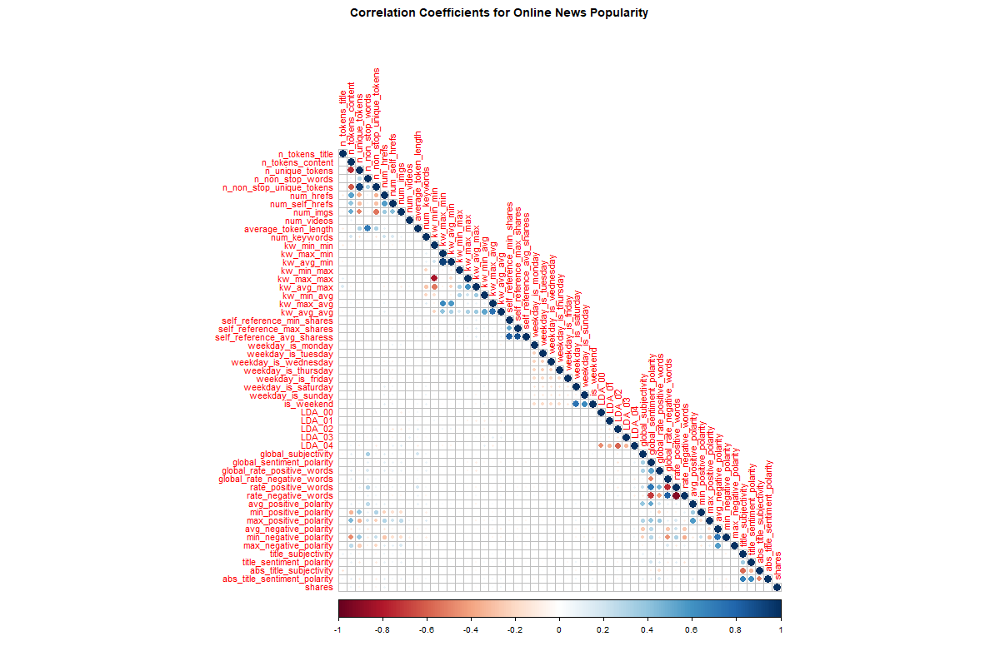
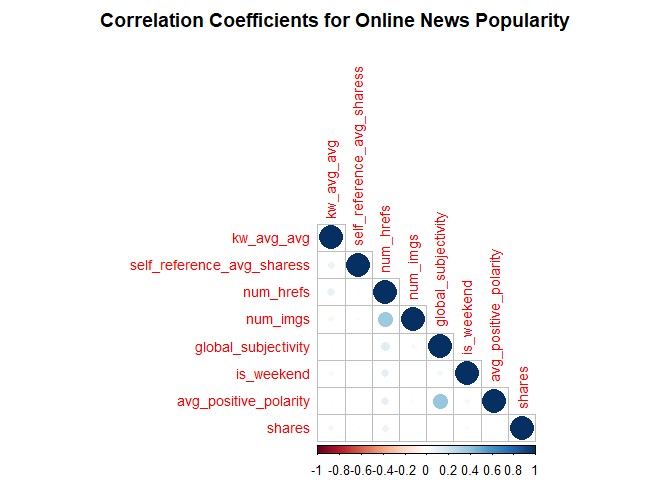
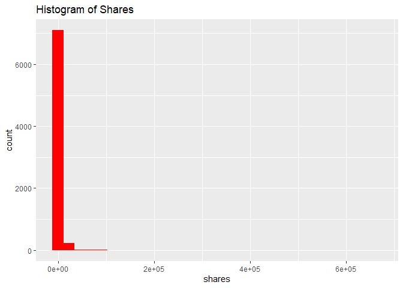
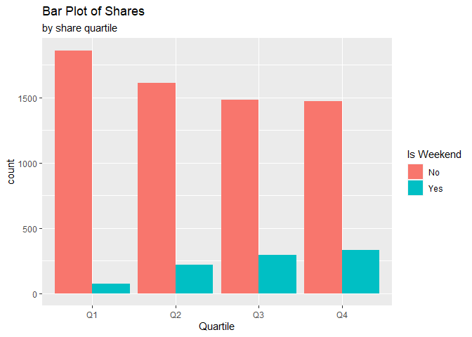
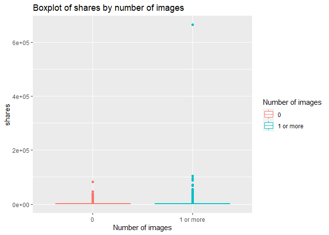
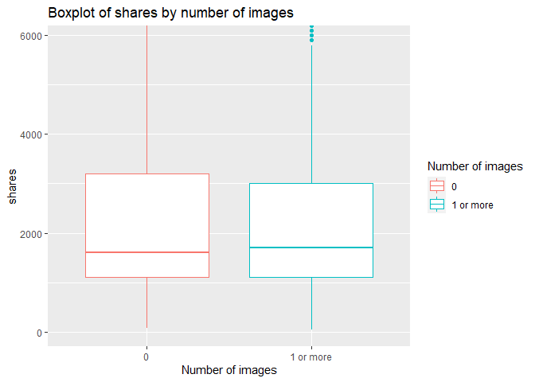
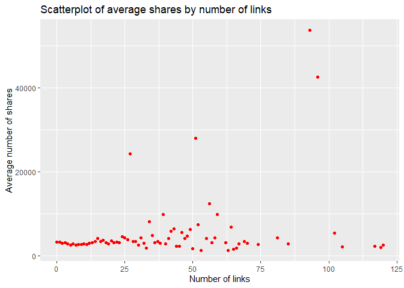
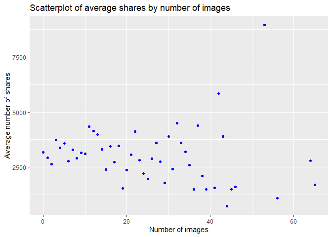

Project 3
================
Umesh Rao & Luke Perkins
2022-11-11

-   <a href="#introduction" id="toc-introduction">Introduction</a>
-   <a href="#data-reading-and-formatting"
    id="toc-data-reading-and-formatting">Data Reading and Formatting</a>
-   <a href="#r-markdown-automating" id="toc-r-markdown-automating">R
    Markdown Automating</a>
-   <a href="#summarizing" id="toc-summarizing">Summarizing</a>
    -   <a href="#correlations" id="toc-correlations">Correlations</a>
    -   <a href="#histogram" id="toc-histogram">Histogram</a>
    -   <a href="#contingency-table" id="toc-contingency-table">Contingency
        Table</a>
    -   <a href="#bar-plot" id="toc-bar-plot">Bar plot</a>
    -   <a href="#box-plot" id="toc-box-plot">Box plot</a>
    -   <a href="#scatter-plot" id="toc-scatter-plot">Scatter plot</a>
-   <a href="#modeling" id="toc-modeling">Modeling</a>
    -   <a href="#regression" id="toc-regression">Regression</a>
    -   <a href="#ensemble-tree-methods" id="toc-ensemble-tree-methods">Ensemble
        Tree Methods</a>
        -   <a href="#random-forest" id="toc-random-forest">Random Forest</a>
        -   <a href="#boosted-trees" id="toc-boosted-trees">Boosted Trees</a>
-   <a href="#comparing-models" id="toc-comparing-models">Comparing
    Models</a>

# Introduction

This project analyzes and models the [Online News
Popularity](https://archive.ics.uci.edu/ml/datasets/Online+News+Popularity)
data set from UCI. The data set covers a range of features about
articles that were published by Mashable over two years. The purpose is
to predict the number of shares in social networks. There are 61 total
variables, however, this analysis will focus on the following:

-   `kw_avg_avg`: average keyword (average shares)  
-   `self_reference_avg_sharess`: average shares of referenced articles
    in Mashable  
-   `num_hrefs`: number of links  
-   `num_imgs`: number of images  
-   `global_subjectivity`: text subjectivity  
-   `is_weekend`: was the article published on the weekend?  
-   `avg_positive_polarity`: average polarity of positive words  
-   `shares`: number of shares; also the target variable being predicted

Rather than analyzing the data in its entirety, this project also
utilizes automation through R Markdown to generate analyses across each
level of the data channel, as gathered from the original data, in
separate reports.

Prior to modeling, an exploratory data analysis (EDA) will be conducted
in efforts to gain a better understanding of the behavior of the data,
in addition to reducing the number of predictors selected. The analysis
will provide indication of the spread, center, and distribution shape of
the variables, as well as the correlation between variables. Several
types of supervised learning techniques will be employed: general linear
modeling (specifically, multiple linear regression), random forests, and
gradient boosted trees.

The entire process can be summarized as:

1.  Read in the data  
2.  Manipulate the data for automation purposes  
3.  Conduct an EDA and select predictors  
4.  Subset data to chosen predictors and split into training and testing
    sets  
5.  Train and tune models, selecting the best model within each method
    via cross-validation  
6.  Predict on the test set with each model and select the ‘best’
    overall by lowest RMSE

# Data Reading and Formatting

To begin, we load in relevant packages with `library()` statements.
Then, `read_csv()` and a relative path is used to read in the data.
`pivot_longer()` is used to reshape the six dummy variables indicating
the data channel into one column. The `cols` argument specifies the data
to restructure from rows to columns, `names_to` names the column
containing the column names from the original data, and `values_to`
names the column containing the actual values being reshaped. `filter()`
is then used to subset the data to only rows where the reshaped values
are 1, as in the ‘long’ data format, those are the only rows of
interest. The `temp` variable containing the indicator values is then
dropped and the object is saved.

``` r
library(tidyverse)
library(caret)
library(corrplot)
library(randomForest)
library(gbm)

news_pop <- read_csv("OnlineNewsPopularity.csv") %>%
  pivot_longer(cols = 14:19, 
               names_to = "data_channel", 
               values_to = "temp") %>%
  filter(temp == 1) %>%
  select(-temp)
```

# R Markdown Automating

The R Markdown is automated by generating separate reports and analyses
by each level of a parameter, in this case, the `data_channel`. First,
the `unique()` function is used to generate a list of unique values for
`data_channel`. Then, `paste0` concatenates the file extension to the
end of each channel ID. `lapply()` takes each concatenated name and
extension, and applies the `list` function to convert each one into a
named list object with one element. A tibble is then created containing
the the output file name and the one item list of the parameterized
`data_channel` value. The full data set `news_pop` then uses `filter()`
to subset records to the `data_channel` variable currently reflected in
the `params` argument in the R Markdown document, and is saved as
`channel`.

``` r
channelIDs <- unique(news_pop$data_channel)
output_file <- paste0(channelIDs, ".md")
param_names <- lapply(channelIDs, FUN = function(x){list(channel = x)})
reports <- tibble(output_file, param_names)
channel <- news_pop %>% filter(data_channel == params$channel)
```

# Summarizing

## Correlations

One strategy in exploring the data is to use a correlation matrix to
view potential linear relationships as a baseline. Using `select()`, the
full data set is subset to drop `url`, `timedelta`, which is indicated
in the variable descriptions as non-predictive, and `data_channel`, as
each analysis is split on the level of this variable, so the values will
all be the same. The `cor()` function creates a correlation matrix using
the Pearson correlation coefficient, and the matrix is saved as
`cor_mat`.

Because the number of variables is large, the `png()` function is called
to adjust the `width` and `height` of the correlation plot, and the file
is saved as a concatenation of the channel name, accessed with `params`,
and “corrplot.png”. The `corr_plot()` function is used to create a
visualization of the matrix, taking the matrix itself as the first
argument. The `type` argument is given as `"lower"` to indicate the
display should be the lower half, `tl.pos` as `"ld"` specifies the text
label positions as left and diagonal, `title` is used to give a relevant
title, and `mar` adjusts the margins so that the title is visible. The
`dev.off()` function closes the graphics device so that the image can
render, and `include_graphics()` prints the plot image.

``` r
summary(channel)
```

    ##      url              timedelta     n_tokens_title 
    ##  Length:7346        Min.   :  8.0   Min.   : 4.00  
    ##  Class :character   1st Qu.:210.0   1st Qu.: 9.00  
    ##  Mode  :character   Median :414.0   Median :10.00  
    ##                     Mean   :391.9   Mean   :10.19  
    ##                     3rd Qu.:574.8   3rd Qu.:12.00  
    ##                     Max.   :731.0   Max.   :20.00  
    ##  n_tokens_content n_unique_tokens  n_non_stop_words
    ##  Min.   :   0.0   Min.   :0.0000   Min.   :0.0000  
    ##  1st Qu.: 256.0   1st Qu.:0.4598   1st Qu.:1.0000  
    ##  Median : 405.0   Median :0.5336   Median :1.0000  
    ##  Mean   : 571.6   Mean   :0.5310   Mean   :0.9971  
    ##  3rd Qu.: 728.0   3rd Qu.:0.6017   3rd Qu.:1.0000  
    ##  Max.   :5530.0   Max.   :0.9143   Max.   :1.0000  
    ##  n_non_stop_unique_tokens   num_hrefs      
    ##  Min.   :0.0000           Min.   :  0.000  
    ##  1st Qu.:0.6165           1st Qu.:  5.000  
    ##  Median :0.6897           Median :  7.000  
    ##  Mean   :0.6829           Mean   :  9.417  
    ##  3rd Qu.:0.7568           3rd Qu.: 11.000  
    ##  Max.   :1.0000           Max.   :120.000  
    ##  num_self_hrefs       num_imgs        num_videos     
    ##  Min.   :  0.000   Min.   : 0.000   Min.   : 0.0000  
    ##  1st Qu.:  2.000   1st Qu.: 1.000   1st Qu.: 0.0000  
    ##  Median :  3.000   Median : 1.000   Median : 0.0000  
    ##  Mean   :  4.641   Mean   : 4.435   Mean   : 0.4472  
    ##  3rd Qu.:  6.000   3rd Qu.: 6.000   3rd Qu.: 1.0000  
    ##  Max.   :116.000   Max.   :65.000   Max.   :73.0000  
    ##  average_token_length  num_keywords      kw_min_min    
    ##  Min.   :0.000        Min.   : 2.000   Min.   : -1.00  
    ##  1st Qu.:4.424        1st Qu.: 7.000   1st Qu.: -1.00  
    ##  Median :4.592        Median : 8.000   Median :  0.00  
    ##  Mean   :4.582        Mean   : 7.776   Mean   : 29.98  
    ##  3rd Qu.:4.756        3rd Qu.: 9.000   3rd Qu.:  4.00  
    ##  Max.   :5.857        Max.   :10.000   Max.   :294.00  
    ##    kw_max_min       kw_avg_min        kw_min_max      
    ##  Min.   :     0   Min.   :   -1.0   Min.   :     0.0  
    ##  1st Qu.:   483   1st Qu.:  162.8   1st Qu.:     0.0  
    ##  Median :   729   Median :  254.1   Median :   990.5  
    ##  Mean   :  1155   Mean   :  317.7   Mean   :  7010.4  
    ##  3rd Qu.:  1100   3rd Qu.:  374.2   3rd Qu.:  5600.0  
    ##  Max.   :104100   Max.   :14716.9   Max.   :663600.0  
    ##    kw_max_max       kw_avg_max       kw_min_avg    
    ##  Min.   :     0   Min.   :     0   Min.   :   0.0  
    ##  1st Qu.:690400   1st Qu.:139970   1st Qu.:   0.0  
    ##  Median :843300   Median :186859   Median : 830.5  
    ##  Mean   :737045   Mean   :213482   Mean   : 996.6  
    ##  3rd Qu.:843300   3rd Qu.:287317   3rd Qu.:1965.5  
    ##  Max.   :843300   Max.   :753450   Max.   :3347.3  
    ##    kw_max_avg       kw_avg_avg   
    ##  Min.   :     0   Min.   :    0  
    ##  1st Qu.:  3444   1st Qu.: 2346  
    ##  Median :  3739   Median : 2698  
    ##  Mean   :  4584   Mean   : 2746  
    ##  3rd Qu.:  4700   3rd Qu.: 3079  
    ##  Max.   :104100   Max.   :19429  
    ##  self_reference_min_shares self_reference_max_shares
    ##  Min.   :     0.0          Min.   :     0           
    ##  1st Qu.:   767.2          1st Qu.:  1700           
    ##  Median :  1300.0          Median :  4000           
    ##  Mean   :  4423.7          Mean   : 11787           
    ##  3rd Qu.:  2700.0          3rd Qu.:  8400           
    ##  Max.   :663600.0          Max.   :663600           
    ##  self_reference_avg_sharess weekday_is_monday
    ##  Min.   :     0             Min.   :0.0000   
    ##  1st Qu.:  1469             1st Qu.:0.0000   
    ##  Median :  2775             Median :0.0000   
    ##  Mean   :  7219             Mean   :0.1681   
    ##  3rd Qu.:  5250             3rd Qu.:0.0000   
    ##  Max.   :663600             Max.   :1.0000   
    ##  weekday_is_tuesday weekday_is_wednesday
    ##  Min.   :0.0000     Min.   :0.0000      
    ##  1st Qu.:0.0000     1st Qu.:0.0000      
    ##  Median :0.0000     Median :0.0000      
    ##  Mean   :0.2007     Mean   :0.1929      
    ##  3rd Qu.:0.0000     3rd Qu.:0.0000      
    ##  Max.   :1.0000     Max.   :1.0000      
    ##  weekday_is_thursday weekday_is_friday
    ##  Min.   :0.0000      Min.   :0.0000   
    ##  1st Qu.:0.0000      1st Qu.:0.0000   
    ##  Median :0.0000      Median :0.0000   
    ##  Mean   :0.1783      Mean   :0.1346   
    ##  3rd Qu.:0.0000      3rd Qu.:0.0000   
    ##  Max.   :1.0000      Max.   :1.0000   
    ##  weekday_is_saturday weekday_is_sunday   is_weekend    
    ##  Min.   :0.00000     Min.   :0.00000   Min.   :0.0000  
    ##  1st Qu.:0.00000     1st Qu.:0.00000   1st Qu.:0.0000  
    ##  Median :0.00000     Median :0.00000   Median :0.0000  
    ##  Mean   :0.07147     Mean   :0.05391   Mean   :0.1254  
    ##  3rd Qu.:0.00000     3rd Qu.:0.00000   3rd Qu.:0.0000  
    ##  Max.   :1.00000     Max.   :1.00000   Max.   :1.0000  
    ##      LDA_00            LDA_01            LDA_02       
    ##  Min.   :0.01819   Min.   :0.01819   Min.   :0.01818  
    ##  1st Qu.:0.02232   1st Qu.:0.02225   1st Qu.:0.02500  
    ##  Median :0.02860   Median :0.02857   Median :0.03333  
    ##  Mean   :0.07409   Mean   :0.06523   Mean   :0.11018  
    ##  3rd Qu.:0.04007   3rd Qu.:0.04000   3rd Qu.:0.15772  
    ##  Max.   :0.83882   Max.   :0.72201   Max.   :0.82213  
    ##      LDA_03            LDA_04        global_subjectivity
    ##  Min.   :0.01818   Min.   :0.01846   Min.   :0.0000     
    ##  1st Qu.:0.02224   1st Qu.:0.54575   1st Qu.:0.4141     
    ##  Median :0.02857   Median :0.73332   Median :0.4598     
    ##  Mean   :0.06186   Mean   :0.68864   Mean   :0.4568     
    ##  3rd Qu.:0.04000   3rd Qu.:0.86658   3rd Qu.:0.5037     
    ##  Max.   :0.74564   Max.   :0.92719   Max.   :0.8127     
    ##  global_sentiment_polarity global_rate_positive_words
    ##  Min.   :-0.33912          Min.   :0.00000           
    ##  1st Qu.: 0.09713          1st Qu.:0.03303           
    ##  Median : 0.14379          Median :0.04187           
    ##  Mean   : 0.14577          Mean   :0.04290           
    ##  3rd Qu.: 0.19102          3rd Qu.:0.05179           
    ##  Max.   : 0.65000          Max.   :0.15217           
    ##  global_rate_negative_words rate_positive_words
    ##  Min.   :0.000000           Min.   :0.0000     
    ##  1st Qu.:0.008696           1st Qu.:0.6667     
    ##  Median :0.013632           Median :0.7524     
    ##  Mean   :0.014436           Mean   :0.7466     
    ##  3rd Qu.:0.018987           3rd Qu.:0.8333     
    ##  Max.   :0.086168           Max.   :1.0000     
    ##  rate_negative_words avg_positive_polarity
    ##  Min.   :0.0000      Min.   :0.0000       
    ##  1st Qu.:0.1667      1st Qu.:0.3139       
    ##  Median :0.2454      Median :0.3560       
    ##  Mean   :0.2506      Mean   :0.3571       
    ##  3rd Qu.:0.3304      3rd Qu.:0.4013       
    ##  Max.   :1.0000      Max.   :1.0000       
    ##  min_positive_polarity max_positive_polarity
    ##  Min.   :0.00000       Min.   :0.0000       
    ##  1st Qu.:0.05000       1st Qu.:0.6000       
    ##  Median :0.10000       Median :0.8000       
    ##  Mean   :0.09917       Mean   :0.7719       
    ##  3rd Qu.:0.10000       3rd Qu.:1.0000       
    ##  Max.   :1.00000       Max.   :1.0000       
    ##  avg_negative_polarity min_negative_polarity
    ##  Min.   :-1.0000       Min.   :-1.0000      
    ##  1st Qu.:-0.2850       1st Qu.:-0.6000      
    ##  Median :-0.2220       Median :-0.4000      
    ##  Mean   :-0.2288       Mean   :-0.4513      
    ##  3rd Qu.:-0.1667       3rd Qu.:-0.2500      
    ##  Max.   : 0.0000       Max.   : 0.0000      
    ##  max_negative_polarity title_subjectivity
    ##  Min.   :-1.0000       Min.   :0.00000   
    ##  1st Qu.:-0.1250       1st Qu.:0.00000   
    ##  Median :-0.1000       Median :0.06667   
    ##  Mean   :-0.1027       Mean   :0.25310   
    ##  3rd Qu.:-0.0500       3rd Qu.:0.47708   
    ##  Max.   : 0.0000       Max.   :1.00000   
    ##  title_sentiment_polarity abs_title_subjectivity
    ##  Min.   :-1.00000         Min.   :0.0000        
    ##  1st Qu.: 0.00000         1st Qu.:0.1556        
    ##  Median : 0.00000         Median :0.5000        
    ##  Mean   : 0.08636         Mean   :0.3447        
    ##  3rd Qu.: 0.15000         3rd Qu.:0.5000        
    ##  Max.   : 1.00000         Max.   :0.5000        
    ##  abs_title_sentiment_polarity     shares      
    ##  Min.   :0.000                Min.   :    36  
    ##  1st Qu.:0.000                1st Qu.:  1100  
    ##  Median :0.000                Median :  1700  
    ##  Mean   :0.136                Mean   :  3072  
    ##  3rd Qu.:0.200                3rd Qu.:  3000  
    ##  Max.   :1.000                Max.   :663600  
    ##  data_channel      
    ##  Length:7346       
    ##  Class :character  
    ##  Mode  :character  
    ##                    
    ##                    
    ## 

``` r
cor_mat <- channel %>% 
  select(-url, -data_channel, -timedelta) %>%
  cor()

png(filename = paste0(params$channel, "corrplot.png"), 
    width = 1200, height = 800)
corrplot(cor_mat,
         type = "lower",
         tl.pos = "ld",
         tl.cex = 0.9,
         mar = c(0, 0, 2, 0),
         title = "Correlation Coefficients for Online News Popularity",
)
dev.off()
```

    ## png 
    ##   2

``` r
knitr::include_graphics(paste0(params$channel, "corrplot.png"))
```

<!-- -->

Dark blue circles indicate there is a strong positive linear
relationship between the variables, dark red indicates a strong negative
linear relationship, and lighter shades of either color indicate weaker
linear relationships. From the plot, the strongest linear relationships
are between related variables, like each of the days of the week,
different measures of keywords, or measures of polarity. The rest of the
variables have weaker relationships, indicating there is little risk of
multicollinearity if variables from different subject matters are
chosen.

To aid in selection, a tibble of top correlations with the `shares`
variable is generated. First, the names of the variables are taken from
the correlation matrix using `row.names()`, then the values of the
correlations across all variables with respect to `shares` is taken by
using `bind_cols` and returning the `shares` column with index 53. The
values are then sorted with `arrange()`, in descending order with
`desc()`, and the top 20 rows are returned with `head()`. The tibble is
then printed for viewing.

In addition to using general knowledge about the content in variable
selection, variables are chosen from different subject matters to avoid
colinearity. So, from this list, one variable from each general area is
selected, in addition to the target variable, then the subset of the
data set is saved and a correlation matrix on the subset is printed as a
table using the `kable()` function.

Another correlation plot is generated on the smaller set of variables
using `corrplot()`, and the results should ideally confirm that the
variables are within acceptable ranges of correlation to each other.

``` r
top_cors <- cor_mat %>%
  row.names() %>%
  bind_cols("values" = cor_mat[ ,53]) %>%
  arrange(desc(values)) %>%
  head(n = 20)
top_cors
```

    ## # A tibble: 20 × 2
    ##    ...1                         values
    ##    <chr>                         <dbl>
    ##  1 shares                       1     
    ##  2 num_hrefs                    0.0779
    ##  3 n_tokens_content             0.0714
    ##  4 kw_avg_avg                   0.0522
    ##  5 num_videos                   0.0339
    ##  6 is_weekend                   0.0286
    ##  7 rate_negative_words          0.0282
    ##  8 kw_min_avg                   0.0245
    ##  9 kw_max_avg                   0.0244
    ## 10 max_negative_polarity        0.0242
    ## 11 title_sentiment_polarity     0.0239
    ## 12 abs_title_sentiment_polarity 0.0237
    ## 13 weekday_is_sunday            0.0228
    ## 14 LDA_00                       0.0220
    ## 15 global_rate_negative_words   0.0215
    ## 16 max_positive_polarity        0.0213
    ## 17 num_keywords                 0.0189
    ## 18 weekday_is_saturday          0.0167
    ## 19 title_subjectivity           0.0166
    ## 20 weekday_is_wednesday         0.0157

``` r
subset_channel <- channel %>%
  select(kw_avg_avg, self_reference_avg_sharess, num_hrefs, num_imgs, 
         global_subjectivity, is_weekend, avg_positive_polarity, shares)
knitr::kable(cor(subset_channel))
```

|                            | kw_avg_avg | self_reference_avg_sharess |  num_hrefs |   num_imgs | global_subjectivity | is_weekend | avg_positive_polarity |    shares |
|:---------------------------|-----------:|---------------------------:|-----------:|-----------:|--------------------:|-----------:|----------------------:|----------:|
| kw_avg_avg                 |  1.0000000 |                  0.0844193 |  0.0971431 | -0.0557778 |           0.0188903 |  0.0448632 |             0.0171300 | 0.0521578 |
| self_reference_avg_sharess |  0.0844193 |                  1.0000000 | -0.0187838 | -0.0252437 |           0.0157306 | -0.0138793 |            -0.0158899 | 0.0144814 |
| num_hrefs                  |  0.0971431 |                 -0.0187838 |  1.0000000 |  0.3661777 |           0.1395554 |  0.1132590 |             0.1099366 | 0.0779286 |
| num_imgs                   | -0.0557778 |                 -0.0252437 |  0.3661777 |  1.0000000 |           0.0357735 |  0.0128652 |             0.0239733 | 0.0082241 |
| global_subjectivity        |  0.0188903 |                  0.0157306 |  0.1395554 |  0.0357735 |           1.0000000 |  0.0590871 |             0.3814563 | 0.0094740 |
| is_weekend                 |  0.0448632 |                 -0.0138793 |  0.1132590 |  0.0128652 |           0.0590871 |  1.0000000 |             0.0444029 | 0.0285670 |
| avg_positive_polarity      |  0.0171300 |                 -0.0158899 |  0.1099366 |  0.0239733 |           0.3814563 |  0.0444029 |             1.0000000 | 0.0031415 |
| shares                     |  0.0521578 |                  0.0144814 |  0.0779286 |  0.0082241 |           0.0094740 |  0.0285670 |             0.0031415 | 1.0000000 |

``` r
corrplot(cor(subset_channel),
         type = "lower",
         tl.pos = "ld",
         tl.cex = 0.9,
         mar = c(0, 0, 2, 0),
         title = "Correlation Coefficients for Online News Popularity",
)
```

<!-- -->

## Histogram

To look at some other summaries of the data, it may be useful to
consider the distribution of the response variable. First, five number
summaries of all of the variables of interest are taken with the
`summary()` function. Means greater than comparative medians could
indicate positive skew, and extremely large maximum values in relation
to the other percentiles could be a sign of heavy skew. Means lower than
comparative medians could indicate negative skew.

A histogram of the number of shares is generated with `ggplot()`. The
range of share values is mapped to the x axis via `aes()` argument, and
the base plotting object is saved. From the base object, a histogram
layer is added with `geom_histogram()`. The color is set to red via
`fill` argument, and a title is added using its respective argument in
the `labs()` layer. If the histogram is skewed to the right, that
indicates that most articles have fewer shares across the full range of
number of shares, and fewer articles have many shares. If the peak is in
the middle, it would indicate that most articles are in the middle of
the spectrum in terms of share counts, and if it the peak is on the
right, it indicates that most articles are highly shared and fewer are
less shared. Multiple peaks or modes could signify multiple populations.

``` r
summary(subset_channel)
```

    ##    kw_avg_avg    self_reference_avg_sharess
    ##  Min.   :    0   Min.   :     0            
    ##  1st Qu.: 2346   1st Qu.:  1469            
    ##  Median : 2698   Median :  2775            
    ##  Mean   : 2746   Mean   :  7219            
    ##  3rd Qu.: 3079   3rd Qu.:  5250            
    ##  Max.   :19429   Max.   :663600            
    ##    num_hrefs          num_imgs      global_subjectivity
    ##  Min.   :  0.000   Min.   : 0.000   Min.   :0.0000     
    ##  1st Qu.:  5.000   1st Qu.: 1.000   1st Qu.:0.4141     
    ##  Median :  7.000   Median : 1.000   Median :0.4598     
    ##  Mean   :  9.417   Mean   : 4.435   Mean   :0.4568     
    ##  3rd Qu.: 11.000   3rd Qu.: 6.000   3rd Qu.:0.5037     
    ##  Max.   :120.000   Max.   :65.000   Max.   :0.8127     
    ##    is_weekend     avg_positive_polarity     shares      
    ##  Min.   :0.0000   Min.   :0.0000        Min.   :    36  
    ##  1st Qu.:0.0000   1st Qu.:0.3139        1st Qu.:  1100  
    ##  Median :0.0000   Median :0.3560        Median :  1700  
    ##  Mean   :0.1254   Mean   :0.3571        Mean   :  3072  
    ##  3rd Qu.:0.0000   3rd Qu.:0.4013        3rd Qu.:  3000  
    ##  Max.   :1.0000   Max.   :1.0000        Max.   :663600

``` r
g <- ggplot(data = subset_channel, aes(x = shares))
g + geom_histogram(fill = "red") +
  labs(title = "Histogram of Shares")
```

<!-- -->

## Contingency Table

One view of interest to consider is the number of shares depending on
whether the article was published on a weekend or not. To view the
`share` variable in another way, it can be divided along its quartiles
with the `cut()` function. Taking the `shares` variable as its first
argument, `cut()` then uses `quantile()` to split up the variable into
value ranges, taking a vector of quantiles with the `probs()` argument.
Labels of the ranges are assigned as the related quartiles with the
`labels` argument. Then, the object is saved and used in the `table()`
function to make a contingency table against the `is_weekend` variable.
`rbind()` takes the table and uses `apply()` to add the proportion of
number of weekend shares of the total split. The `MARGIN` argument is
set to 2 to indicate column proportions are being calculated, and the
`FUN` argument takes in the function to apply: in this case, the number
of weekend shares divided by the sum of shares for the split, rounded to
3 decimals.

Proportions trending higher from left to right indicate that it is more
common for articles with higher shares to be published on a weekend for
that particular data channel relative to articles with lower shares, and
proportions trending lower from left to right indicate the converse. If
neither case is true, there may be no clear linear pattern.

``` r
quart_shares <- cut(subset_channel$shares, 
                    breaks = quantile(subset_channel$shares, 
                                      probs = c(0, 0.25, 0.5, 0.75, 1)),
                    labels = c("Q1", "Q2", "Q3", "Q4"))
tab <- table(subset_channel$is_weekend, quart_shares)
rbind(tab, apply(tab, MARGIN = 2, FUN = function(x){round(x[2] / sum(x), 3)}))
```

    ##         Q1      Q2       Q3       Q4
    ## 0 1860.000 1613.00 1480.000 1471.000
    ## 1   75.000  220.00  294.000  332.000
    ##      0.039    0.12    0.166    0.184

## Bar plot

The contingency table can be graphically visualized as a bar plot.
First, the data is subset to only the `is_weekend` variable, and the
factor of quartiles created previously with the `cut()` function is
added using `mutate()`. Then, the `drop_na()` function is used on the
quartiles to prevent an empty fill of `NA` in the bar plot, and the new
data set is saved as `bar_data`.

A base plotting object is then created with the subset `bar_data`,
mapping the quartiles to the x axis as an aesthetic within the `aes()`
function. A bar geom layer is added using `geom_bar()`, with
`is_weekend`, which is converted to a factor, mapped to the bar fills
using the `fill` argument within the `aes()` mapping. The `position`
argument is set to `"dodge"` to display the bar fills side-by-side.
Appropriate labels are then added with a `labs()` layer, setting the
title, subtitle, x axis, and fill labels with their respective
arguments. A final label is added with `scale_fill_discrete()`, changing
the fill labels in the legend from 0 and 1 to “No” and “Yes”.

From the plot, the same trends in the contingency table can be tracked.
Differing fill heights within a quartile will indicate whether articles
published on a weekend had more or less shares for that relative range
of shares(the quartile), and changes in height for the same fill across
quartiles will indicate if more articles are shared in higher volumes
for that setting of weekday vs. weekend. If the bars go up, then the
number of articles that are shared for higher share ranges increase; if
the bars go down, then the number of articles share for higher share
ranges decrease, and if the bars do neither, then there is no clear
linear trend.

``` r
bar_data <- subset_channel %>%
  select(is_weekend) %>%
  mutate(quart_shares = quart_shares) %>%
  drop_na(quart_shares)

g <- ggplot(data = bar_data, aes(x = quart_shares))
g + geom_bar(aes(fill = as.factor(is_weekend)), 
             position = "dodge") +
  labs(title = "Bar Plot of Shares",
       subtitle = "by share quartile",
       x = "Quartile",
       fill = "Is Weekend") +
  scale_fill_discrete(labels = c("No", "Yes"))
```

<!-- -->

## Box plot

Another interesting grouping is to examine shares by the number of
images. Many articles do not use images at all, so it may be interesting
to contrast those that do with those that do not. The `cut()` function
is used to split the variable of interest again, this time from 0 to 1
or more. The `labels` argument is used to give labels for cleaner plots,
and `right` is set to `FALSE` to make the splits exclude the right
value, meaning 0 is the first split, and the second split starts at 1. A
base plotting object is created again, this time mapping the cut
variable `img_split` on the x axis, and the number of shares on the y
axis. A box plot layer is added with `geom_boxplot()`, mapping the split
levels as the color. Labels for the title, x axis, and legend are added
by arguments of `"title"`, `"x"`, and `"color"`, respectively, within
the `labs()` function.

Because the distribution of shares could be highly skewed, there may be
many outliers and the box plot may not be visually appealing or useful.
Although outliers should not be removed without cause, to gain a better
view of the data, one consideration is to view the box plot without
them. A similar box plot with the same syntax, but adding a coordinate
layer with `coord_cartesian()` is generated, specifying the `ylim`
argument to range from 0 to the 90th percentile of `shares` to show a
better scale that hides some outliers. Many points above the boxes, a
long tail above the box plots, or the median line being located towards
the bottom of the boxes could indicate positive skew. Points towards the
bottom, a long tail below the box plots, or the median line being
indicated towards the top of the boxes could indicate negative skew.
Relatively symmetric tails, a median close to the center of the boxes,
and few outliers would indicate a symmetric distribution. If the size of
the box or the length of its tail for the number of images being 0 is
larger/longer, then there is more variability in the number of shares
for articles with 0 images when compared to those with 1 or more. If the
boxes and tails are smaller/shorter, then there is less variability in
the number of shares for articles with 0 images when compared to those 1
or more.

``` r
img_split <- cut(subset_channel$num_imgs, 
                 breaks = c(0, 1, Inf),
                 labels = c("0", "1 or more"),
                 right = FALSE)
g <- ggplot(data = subset_channel, aes(x = img_split, y = shares))
g + geom_boxplot(aes(color = img_split)) +
  labs(title = "Boxplot of shares by number of images",
       x = "Number of images",
       color = "Number of images")
```

<!-- -->

``` r
g <- ggplot(data = subset_channel, aes(x = img_split, y = shares))
g + geom_boxplot(aes(color = img_split)) +
  labs(title = "Boxplot of shares by number of images",
       x = "Number of images",
       color = "Number of images") +
  coord_cartesian(ylim = c(0, quantile(subset_channel$shares, 0.90)))
```

<!-- -->

## Scatter plot

Another view to consider is the average number of shares across
variables. First, the data is summarized by using the `group_by`
function on `num_hrefs` to create a grouping by number of links, then,
the `summarize()` function calls the `mean()` function to take the
average number of shares across each value of the number of links. The
same idea is done to summarize the average number of shares across the
number of links, using the same syntax.

To create a scatter plot for the average shares by number of links, a
base plotting object is created with `ggplot()`, using the summarized
`avg_links` as the reference data set. A geom layer using `geom_point()`
maps the aesthetics of number of links on the x axis and average shares
on the y axis, and the `color` argument colors the points red. Then, a
label layer adds title, x axis, y axis labels. A scatter plot for the
average shares by number of links is added, using the same syntax, but
substituting the corresponding data set, variables, and labels.

When viewing the plots, a trend of points moving upwards from left to
right would indicate the average number of shares increases with the
number of links or images in articles, and a trend of points moving
downwards from right to left would indicate the average number of shares
decreases with the number of the number of links or images in articles.
Points having no general direction would indicate little or no trend in
a linear relationship.

``` r
avg_links <- subset_channel %>%
  group_by(num_hrefs) %>%
  summarize(avg_shares = mean(shares))

avg_imgs <- subset_channel %>%
  group_by(num_imgs) %>%
  summarize(avg_shares = mean(shares))

g <- ggplot(data = avg_links)
g + geom_point(aes(x = num_hrefs, y = avg_shares), color = "red") +
  labs(title = "Scatterplot of average shares by number of links",
       x = "Number of links",
       y = "Average number of shares")
```

<!-- -->

``` r
g <- ggplot(data = avg_imgs)
g + geom_point(aes(x = num_imgs, y = avg_shares), color = "blue") +
  labs(title = "Scatterplot of average shares by number of images",
       x = "Number of images",
       y = "Average number of shares")
```

<!-- -->

# Modeling

## Regression

**Explanation**: Linear regression is a supervised learning technique
where the value of a response variable is modeled or predicted by an
explanatory variable by fitting a linear equation to observed data. The
equation of the line can be modeled generically by:
`Y~i~ = B~0~ + B~1~x~i~ + E~i~ where Y~i~` is the response for the
i<sup>th</sup> observation, `x~i~` is the value of the explanatory
variable for the i<sup>th</sup> observation, `B~0~` is the y-intercept,
`B~1~` is the slope, and `E~i~` is the error. The modeling is considered
because the coefficients are linear. The line of best fit is found by
minimizing the sum of squared differences between the observed values
and the predicted values on the line itself.

To model the data, first it needs to be split into a training set and
test set. The `createDataPartition()` takes the `shares` variable and
samples 70% of the indices by passing 0.7 to the `p` argument, and
lastly, outputs the results as a matrix by setting the `list` argument
to `FALSE`. The indices are saved and used to subset the data set on the
variables of interest by using the `[` function and accessing the
indices as the rows. The training set is saved, and the same method is
used to obtain a test set, but using the `-` function to access the
indices that were not sampled.

The `train()` function fits a multiple linear regression model of
`shares`, modeled by the remaining main effect terms of the variables
chosen during the correlation section above using the `~` function. All
variables are chosen because it is not clear which are needed for the
best results. The data used is the training set, and the `method`
argument is passed `"lm"` to indicate a linear model. The model is saved
as `mlr`.

A second multiple linear regression model is fitted using the same
methodology and syntax, but uses all main effects and all interaction
terms via `~.^2` in the formula argument. This serves as a contrasting
model to determine whether or not including all interactions improves
predictions.

``` r
dataIndex <- createDataPartition(subset_channel$shares, p = 0.7, list = FALSE)
dataTrain <- subset_channel[dataIndex, ]
dataTest <- subset_channel[-dataIndex, ]

mlr <- train(shares ~., data = dataTrain, method ="lm")
mlr2<- train(shares ~.^2, data = dataTrain, method ="lm")
```

## Ensemble Tree Methods

### Random Forest

**Explanation:** A random forest model is an ensemble learning method
where many trees are fitted and their results are averaged. The basic
concept is that given a sample, that sample is resampled in the same
manner as the original, repeatedly. The samples, called bootstrap
samples, are taken with replacement, so that duplicate observations may
be present, and some observations may be omitted. A tree is then trained
on each sample, using a random subset of the variables. This is done to
reduce variance; if a dominant predictor is present most of the trees
will use the same first splits, and will be highly correlated. After all
of the predictions are done, the final predictions are the average of
all individual tree predictions, or if using classification, the final
prediction is the majority vote by all trees.

Before fitting the tree model, a random number generator seed is first
set to reproduce the random aspects of the training. The `train()`
function then takes in the response modeled by all predictors. The
`data` argument passes the training set and `method` specifies `rf` for
random forest. `trControl` passes training parameters, produced by the
`trainControl()` argument, where `method` and `number` specify the
resampling method as cross validation and the number of folds,
respectively. `preProcess` passes a vector of `"center"` and `"scale"`
to center and scale the data, and those values are saved and also used
to process the testing data later. `tuneGrid` passes a data frame of
tuning parameters; for random forests, the parameters are the number of
random variables to try, labeled as `mtry`, and given as a sequence. The
fit is then saved.

``` r
#Set eval = FALSE to test
#random Forest
#updated number to 3 to run faster, can change to 5 before submission.
set.seed(99)
rfFit <- train(shares ~ ., data = dataTrain,
               method = "rf",
               trControl = trainControl(method = "cv",
                                        number = 3),
               preProcess = c("center", "scale"),
               tuneGrid = data.frame(mtry = 1:6))
```

### Boosted Trees

**Explanation:** A boosted tree model is an ensemble learning method
wherein trees are fitted sequentially, and each tree is fitted based on
the previous one, updated by predictions each time. The general concept
is that the trees are fitted, given a specified number of splits, based
on residuals of predictions, which are updated slowly. In more detail,
first the predictions are initialized to 0, then the residuals are
calculated and trees are fitted on the residuals, then the predictions
are updated to the predictions prior to the residuals prior to the
fitting plus the new predictions multiplied by a shrinkage parameter to
slow the growth. Lastly, the residuals used to fit the next tree on are
updated from the new predictions, and the process repeats until a
predefined stopping point.

Before fitting the boosted tree, a grid of tuning parameters is
generated with the `expand.grid()` function, which outputs all possible
combinations of the vectors passed. This fits trees on each combination
so that the best model can be chosen. Because they are being used in the
`tuneGrid` argument, the vectors are named explicitly. The tuning
parameters are as follows:

-   `n.trees` is the number of trees to fit sequentially.  
-   `interaction.depth` is the maximum depth of each tree, or the
    highest level of variable interactions allowed.  
-   `shrinkage` is the shrinkage parameter, or the multiplier to use to
    update predictions after each sequential fit.  
-   `n.minobsinnode` is the minimum number of observations allowed in
    the terminal nodes of each tree.

The grid is saved, and then the `trainControl()` function again chooses
the training parameters, but now using 10 folds. The random number
generator seed is then reset. The `train()` function uses the same
syntax before, but this time indicates `"gbm"` as the method, the
`tuneGrid` argument is passed the expanded grid, and `verbose` is set to
`FALSE` to hide the outputs of every fit.

``` r
caretGrid <- expand.grid(interaction.depth = c(1,2,3,4), 
                         n.trees = c(25,50,100,150,200),
                         shrinkage = 0.1,
                         n.minobsinnode = 10)
trainControl <- trainControl(method = "cv", number = 10)

set.seed(99)
btFit <- train(shares ~ ., data = dataTrain,
               method = "gbm",
               trControl = trainControl,
               preProcess = c("center", "scale"),
               tuneGrid = caretGrid,
               verbose = FALSE)
```

# Comparing Models

To compare all of the models on the test set and evaluate the results at
once, a function is created. `pred_val()` takes arguments of a named
list of models, `models`, the test data set, `newdata`, and a vector of
true responses, `obs`. First, the names are extracted from the list of
models using the `name()` function, and saved as a temporary object.
Next, `lapply()` applies the `predict()` function to the list of models,
taking the user-provided `newdata` variable as the test data to predict
on. The predictions are saved as `preds`. Then, the `sapply()` function
takes those predictions and applies the `postResample()` function to
them to evaluate prediction error, taking the user-provided `obs`
argument as the true responses. The RMSE, Rsquared, and MAE are saved
for each model, simplified on output, and saved. The `which.min()`
function returns the name and index of the model with the minimum RMSE,
accessing the first row of the table of evaluation results, as RMSE is
the metric being used to evaluate the ‘best’ model. The ‘best’ model is
then saved by using bracket notation and the index. A list is returned
from the function with the results of testing all models, the results of
the ‘best’ model, and the name of the ‘best’ model.

To apply the function, a named list of all of the models created in this
document is produced and saved, then the `pred_eval()` function takes
that list, the test data, and the vector of observed responses as
arguments, and predicts on and evaluates the models. The output is then
printed for viewing, and the compared metrics are output in a table for
better display.

``` r
#change RHS of rfFit before submitting; used as-is for testing
pred_eval <- function(models, newdata, obs){
  names <- names(models)
  preds <- lapply(models, FUN = predict, newdata)
  evals <- sapply(preds, FUN = postResample, obs)
  index <- which.min(evals[1, ])
  best <- evals[ ,index]
  return(list(evals, best, names[index]))
}

models <- list(mlr = mlr, mlr2 = mlr2, btFit = btFit, rfFit = mlr)
comp_results <- pred_eval(models, dataTest, dataTest$shares)
comp_results
```

    ## [[1]]
    ##                   mlr         mlr2        btFit
    ## RMSE     5.350171e+03 5.521503e+03 5.337923e+03
    ## Rsquared 9.835973e-03 8.070716e-03 1.220913e-02
    ## MAE      2.409999e+03 2.466996e+03 2.390283e+03
    ##                 rfFit
    ## RMSE     5.350171e+03
    ## Rsquared 9.835973e-03
    ## MAE      2.409999e+03
    ## 
    ## [[2]]
    ##         RMSE     Rsquared          MAE 
    ## 5.337923e+03 1.220913e-02 2.390283e+03 
    ## 
    ## [[3]]
    ## [1] "btFit"

``` r
knitr::kable(comp_results[[1]])
```

|          |         mlr |         mlr2 |        btFit |       rfFit |
|:---------|------------:|-------------:|-------------:|------------:|
| RMSE     | 5350.170680 | 5521.5032351 | 5337.9227875 | 5350.170680 |
| Rsquared |    0.009836 |    0.0080707 |    0.0122091 |    0.009836 |
| MAE      | 2409.998598 | 2466.9964009 | 2390.2826685 | 2409.998598 |

From the results, the ‘best’ model of the four fits based on RMSE
prediction error is btFit with an RMSE of 5337.9227875.
