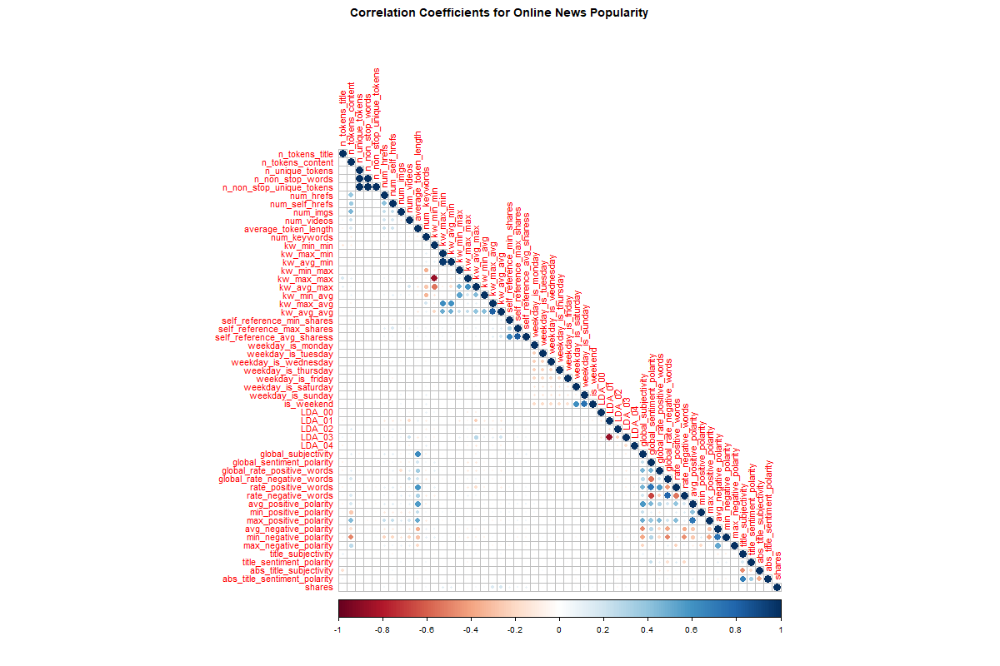

```{r setup, include=FALSE}
knitr::opts_chunk$set(echo = TRUE, warnings = FALSE, message = FALSE)
```

# Introduction

# Data Reading and Formatting

To begin, we load in relevant packages with `library()` statements. Then, 
`read_csv()` and a relative path is used to read in the data. `pivot_longer()` 
is used to reshape the six dummy variables indicating the data channel into one 
column. The `cols` argument specifies the data to restructure from rows to 
columns, `names_to` names the column containing the column names from the 
original data, and `values_to` names the column containing the actual values 
being reshaped. `filter()` is then used to subset the data to only rows where 
the reshaped values are 1, as in the 'long' data format, those are the only 
rows of interest. The `temp` variable containing the indicator values is then 
dropped and the object is saved.

```{r }
library(tidyverse)
library(caret)
library(class)
library(corrplot)

news_pop <- read_csv("OnlineNewsPopularity.csv") %>%
  pivot_longer(cols = 14:19, 
               names_to = "data_channel", 
               values_to = "temp") %>%
  filter(temp == 1) %>%
  select(-temp)
```

# R Markdown Automation

The R Markdown is automated by generating separate reports and analyses by each 
level of a parameter, in this case, the `data_channel`. First, the `unique()` 
function is used to generate a list of unique values for `data_channel`. Then, 
`paste0` concatenates the file extension to the end of each channel ID. 
`lapply()` takes each concatenated name and extension, and applies the `list` 
function to convert each one into a named list object with one element. A tibble 
is then created containing the the output file name and the one item list of 
the parameterized `data_channel` value. The full data set `news_pop` then uses 
`filter()` to subset records to the `data_channel` variable currently reflected 
in the `params` argument in the R Markdown document, and is saved as `channel`.

```{r}
#r markdown automation. Needs to run to get reports object before running the 2nd chunk below in console
channelIDs <- unique(news_pop$data_channel)
output_file <- paste0(channelIDs, ".html")
param_names <- lapply(channelIDs, FUN = function(x){list(channel = x)})
reports <- tibble(output_file, param_names)
channel <- news_pop %>% filter(data_channel == params$channel)
```

PLACEHOLDER

```{r, eval = FALSE}
#run this in console for individual channel
rmarkdown::render("testparams.Rmd", 
                  output_file = "data_channel_is_entertainment.html",
                  params = list(channel = "data_channel_is_entertainment"))

#run this in console for all channels
library(rmarkdown)

apply(reports, MARGIN = 1,
      FUN = function(x){
        render(input = "testparams.Rmd", output_file = x[[1]], params = x[[2]])
      }
)
```

# Summarizations

## Correlations

One strategy in exploring the data is to use a correlation matrix to view 
potential linear relationships as a baseline. Using `select()`, the full data 
set is subset to drop `url`, `timedelta`, which is indicated in the variable 
descriptions as non-predictive, and `data_channel`, as each analysis is split 
on the level of this variable, so the values will all be the same. The 
`cor()` function creates a correlation matrix using the Pearson correlation 
coefficient, and the matrix is saved as `cor_mat`.

Because the number of variables is large, the `png()` function is called to 
adjust the `width` and `height` of the correlation plot, and the file is saved 
as "corrplot.png". The `corr_plot()` function is used to create a visualization 
of the matrix, taking the matrix itself as the first argument. The `type` 
argument is given as `"lower"` to indicate the display should be the lower half, 
`tl.pos` as `"ld"` specifies the text label positions as left and diagonal, 
`title` is used to give a relevant title, and `mar` adjusts the margins so that 
the title is visible. The `dev.off()` function closes the graphics device so 
that the image can render, and `include_graphics()` prints the plot image.

```{r}
summary(channel)

cor_mat <- channel %>% 
  select(-url, -data_channel, -timedelta) %>%
  cor()

png(filename = "corrplot.png", width = 1200, height = 800)
corrplot(cor_mat,
         type = "lower",
         tl.pos = "ld",
         tl.cex = 0.9,
         mar = c(0, 0, 2, 0),
         title = "Correlation Coefficients for Online News Popularity",
)
dev.off()

```

Dark blue circles indicate there is a strong positive linear relationship 
between the variables, dark red indicates a strong negative linear relationship, 
and lighter shades of either color indicate weaker linear relationships. From 
the plot, the strongest linear relationships are between related variables, like 
each of the days of the week, different measures of keywords, or measures of 
polarity. The rest of the variables have weaker relationships, indicating there 
is little risk of multicollinearity if variables from different subject matters 
are chosen.

To aid in selection, a tibble of top correlations with the `shares` variable is 
generated. First, the names of the variables are taken from the correlation 
matrix using `row.names()`, then the values of the correlations across all 
variables with respect to `shares` is taken by using `bind_cols` and returning 
the `shares` column with index 53. The values are then sorted with `arrange()`, 
in descending order with `desc()`, and the top 20 rows are returned with 
`head()`. The tibble is then printed for viewing.

Variables are chosen from different subject matters to avoid colinearity, so 
from this list, one from each general area is selected, in addition to the 
target variable, then the subset of the data set is saved and a correlation 
matrix on the subset is printed as a data frame.

Another correlation plot is generated on the smaller set of variables using 
`corrplot()`, and we can confirm that the variables are within acceptable 
ranges of correlation to each other.

```{r}
top_cors <- cor_mat %>%
  row.names() %>%
  bind_cols("values" = cor_mat[ ,53]) %>%
  arrange(desc(values)) %>%
  head(n = 20)
top_cors

subset_channel <- channel %>%
  select(kw_avg_avg, self_reference_avg_sharess, num_hrefs, num_imgs, 
         global_subjectivity, is_weekend, avg_positive_polarity, shares)
data.frame(cor(subset_channel))

corrplot(cor(subset_channel),
         type = "lower",
         tl.pos = "ld",
         tl.cex = 0.9,
         mar = c(0, 0, 2, 0),
         title = "Correlation Coefficients for Online News Popularity",
)
```

## Histogram

To look at some other summaries of the data, it may be useful to consider the 
distribution of the response variable. First, five number summaries of all of 
the variables of interest are taken with the `summary()` function. Means greater 
than comparative medians could indicate positive skew, and extremely large 
maximum values in relation to the other percentiles could be a sign of heavy 
skew. Means lower than comparative medians could indicate negative skew.

A histogram of the number of shares is generated with `ggplot()`. The range of 
share values is mapped to the x axis via `aes()` argument, and the base plotting 
object is saved. From the base object, a histogram layer is added with 
`geom_histogram()`. The color is set to red via `fill` argument, and a title is 
added using its respective argument in the `labs()` layer. If the histogram is 
skewed to the right, that indicates that most articles have fewer shares across 
the full range of number of shares, and fewer articles have many shares. If the 
peak is in the middle, it would indicate that most articles are in the middle 
of the spectrum in terms of share counts, and if it the peak is on the right, it 
indicates that most articles are highly shared and fewer are less shared.

```{r}
summary(subset_channel)

g <- ggplot(data = subset_channel, aes(x = shares))
g + geom_histogram(fill = "red") +
  labs(title = "Histogram of Shares")
```

## Contingency Table

It might be interesting to look at the number of shares depending on whether 
the article was published on a weekend or not. To view the `share` variable in 
another way, it can be divided along its quartiles with the `cut()` function. 
Taking the `shares` variable as its first argument, `cut()` then uses 
`quantile()` to split up the variable into value ranges, taking a vector of 
quantiles with the `probs()` argument. The object is saved, and used in the 
`table()` function to make a contingency table against the `is_weekend` 
variable. `rbind()` takes the table and uses `apply()` to add the proportion of 
number of weekend shares of the total split. The `MARGIN` argument is set to 2 
to indicate column proportions are being calculated, and the `FUN` argument 
takes in the function to apply: in this case, the number of weekend shares 
divided by the sum of shares for the split, rounded to 3 decimals. Proportions 
trending higher from left to right indicate that it is more common for articles 
with higher shares to be published on a weekend for that particular data 
channel, and proportions trending lower from left to right indicate the 
converse. If neither case is true, there may be no clear pattern.

```{r}
quart_shares <- cut(subset_channel$shares, 
                    breaks = quantile(subset_channel$shares, 
                                      probs = c(0, 0.25, 0.5, 0.75, 1)))
tab <- table(subset_channel$is_weekend, quart_shares)
rbind(tab, apply(tab, MARGIN = 2, FUN = function(x){round(x[2] / sum(x), 3)}))
```

## Box plot

Another interesting grouping is to examine shares by the number of images. 
Many articles do not use images at all, so it may be interesting to contrast 
those that do with those that do not. The `cut()` function is used to split the 
variable of interest again, this time from 0 to 1 or more. The `labels` argument 
is used to give labels for cleaner plots, and `right` is set to `FALSE` to make 
the splits exclude the right value, meaning 0 is the first split, and the second 
split starts at 1. A base plotting object is created again, this time mapping 
the cut variable `img_split` on the x axis, and the number of shares on the y 
axis. A box plot layer is added with `geom_boxplot()`, mapping the split levels 
as the color. Labels for the x axis added and title are added with the `labs()` 
function.

Because the distribution of shares could be highly skewed, there may be many 
outliers and the box plot may not be visually appealing or useful. Although 
outliers should not be removed without cause, to gain a better view of the data, 
a consideration may be to view the box plot without them. A similar box plot 
with the same syntax, but adding a coordinate layer with `coord_cartesian()` is 
generated, specifying the `ylim` argument to range from 0 to the 90th 
percentile of `shares` to show a better scale that hides some outliers. Many 
points above the boxes, a long tail above the box plots, or the median line 
being located towards the bottom of the boxes could indicate positive skew. 
Points towards the bottom would, a long tail below the box plots, or the median 
line being indicated towards the top of the boxes could indicate negative skew. 
Relatively symmetric tails, a median close to the center of the boxes, and few 
outliers would indicate a symmetric distribution.

```{r}
img_split <- cut(subset_channel$num_imgs, 
                 breaks = c(-Inf, 1, Inf),
                 labels = c("0", "1 or more"),
                 right = FALSE)
g <- ggplot(data = subset_channel, aes(x = img_split, y = shares))
g + geom_boxplot(aes(color = img_split)) +
  labs(title = "Boxplot of shares by number of images",
       x = "Number of images")

g <- ggplot(data = subset_channel, aes(x = img_split, y = shares))
g + geom_boxplot(aes(color = img_split)) +
  labs(title = "Boxplot of shares by number of images",
       x = "Number of images") +
  coord_cartesian(ylim = c(0, quantile(subset_channel$shares, 0.90)))
```

# Modeling

## Regression

To model the data, first it needs to be split into a training set and test set. 
The `createDataPartition()` takes the `shares` variable and samples 70% of the 
indices by passing 0.7 to the `p` argument, and lastly, outputs the results as 
a matrix by setting the `list` argument to `FALSE`. The indices are saved and 
used to subset the data set on the variables of interest by using the `[` 
function and accessing the indices as the rows. The training set is saved, and 
the same method is used to obtain a test set, but using the `-` function to 
access the indices that were not sampled.

The `train()` function fits a multiple linear regression model of `shares`, 
modeled by the remaining main effect terms of the variables chosen during the 
correlation section above. The data used is the training set, and the 
`method` argument is passed "lm" to indicate a linear model. The model is saved 
as `mlr`.

**Aside**: 
Linear regression is a supervised learning technique where the value of the of a 
response variable is modeled or predicted by an explanatory variable by fitting 
a linear equation to observed data. The equation of the line can be modeled 
generically by: `Y~i~ = B~0~ + B~1~x~i~ + E~i~ where Y~i~` is the response for 
the i^th^ observation, `x~i~` is the value of the explanatory variable for the 
i^th^ observation, `B~0~` is the y-intercept, `B~1~` is the slope, and `E~i~` is 
the error. The line of best fit is found by minimizing the sum of squared 
differences between the observed values and the predicted values on the line 
itself.

The modeled regression line is used to predict on the test data set using the
`predict()` function. Those predictions are then evaluated for prediction error 
by being passed as the first argument of `postResample()` with the actual 
`shares` observations as the second argument. RMSE, Rsquared, and MAE are 
output. 

A second multiple linear regression model is fitted, predicted on, and evaluated 
using the same methodology and syntax, but uses all main effects and all 
interaction terms via `~.^2` in the formula argument.

```{r}
dataIndex <- createDataPartition(subset_channel$shares, p = 0.7, list = FALSE)
dataTrain <- subset_channel[dataIndex, ]
dataTest <- subset_channel[-dataIndex, ]

mlr <- train(shares ~., data = dataTrain, method ="lm")
pmlr <- predict(mlr, newdata = dataTest)
postResample(pmlr, dataTest$shares)

mlr2<- train(shares ~.^2, data = dataTrain, method ="lm")
pmlr2<- predict(mlr2, newdata = dataTest)
postResample(pmlr2, dataTest$shares)
```

## Ensemble Tree Methods

### Random Forest

**Explanation:** A random forest model is an ensemble learning method where 
many trees are fitted and their results are averaged. The basic concept is that 
given a sample, that sample is resampled in the same manner as the original 
repeatedly. The samples are taken with replacement, so that duplicate 
observations may be present, and some observations may be omitted. A tree is 
then trained on each sample, called a bootstrap sample, using a random subset 
of the variables. This is done to reduce variance; if a dominant predictor is 
present most of the trees will use the same first splits, and will be highly 
correlated. After all of the predictions are done, the final predictions are the 
average of all the individual tree predictions, or if using a classification 
prediction, the final prediction is the majority vote by all trees.

Before fitting the tree model, a random number generator seed is first set to 
reproduce the random aspects of the training. The `train()` function then takes 
in the response modeled by all predictors. The `data` argument passes the 
training set and `method` specifies `rf` for random forest. `trControl` passes 
training parameters, produced by the `trainControl()` argument, where `method` 
and `number` specify the resampling method as cross validation and the number of 
folds, respectively. `preProcess` passes a vector of `"center"` and `"scale"` to 
center and scale the data, and those values are saved and also used to process 
the testing data later. `tuneGrid` passes a data frame of tuning parameters; for 
random forests, the parameters are the number of random variables to try, 
labeled as `mtry`, and given as a sequence. The fit is then saved.

Predictions are made from the random forest fit using the `predict()` function 
and the results are evaluated. The same methodology and syntax from the linear 
modeling is used.

Set to eval = FALSE to test
```{r, eval = FALSE}
#random Forest
#updated number to 3 to run faster, can change to 5 before submission.
set.seed(99)
rfFit <- train(shares ~ ., data = dataTrain,
               method = "rf",
               trControl = trainControl(method = "cv",
                                        number = 3),
               preProcess = c("center", "scale"),
               tuneGrid = data.frame(mtry = 1:6))

pred <- predict(rfFit, newdata = dataTest)
postResample(pred, dataTest$shares)
```

### Boosted Trees

**Explanation:** A boosted tree model is an ensemble learning method wherein 
trees are fitted sequentially, and each tree is fitted based on the previous 
one, updated by predictions each time. The general concept is that the trees 
are fitted, given a specified number of splits, based on residuals of 
predictions that are updated slowly. In detail, first the predictions are 
initialized to 0, then the residuals are calculated, then trees are fitted on 
the residuals, then the predictions are updated to the predictions prior to the 
residuals prior to the fitting plus the new predictions multiplied by a 
shrinkage parameter to slow the growth. Then, the residuals to fit the next tree 
on are updated from the new predictions, an the process repeats until a 
predefined stopping point.

Before fitting the boosted tree, a grid of tuning parameters is generated with 
the `expand.grid()` function, which outputs all possible combinations of the 
vectors passed. This fits trees on each combination so that the best model can 
be chosen. Because they are being used in the `tuneGrid` argument, the 
vectors are named explicitly. The tuning parameters are as follows:  

  + `n.trees` is the number of trees to fit sequentially.  
  + `interaction.depth` is the maximum depth of each tree, or the highest level of variable interactions allowed.  
  + `shrinkage` is the shrinkage parameter, or the multiplier to use to update predictions after each sequential fit.  
  + `n.minobsinnode` is the minimum number of observations allowed in the terminal nodes of each tree.

The grid is saved, and then the `trainControl()` function again chooses the 
training parameters, this time with 10 folds. The `gbm` package is then read in 
to be used with the `train()` function, and the random number generator seed is 
reset. The `train()` function uses the same syntax before, but this time 
indicates `"gbm"` as the method, the `tuneGrid` argument is passed the 
expanded grid, and `verbose` is set to `FALSE` to hide the outputs of every fit. 
The predictions are then generated and evaluated using the same syntax and 
methodology previously.

```{r}
caretGrid <- expand.grid(interaction.depth = c(1,2,3,4), 
                         n.trees = c(25,50,100,150,200),
                         shrinkage = 0.1,
                         n.minobsinnode = 10)
trainControl <- trainControl(method ="cv", number = 10)

library(gbm)
set.seed(99)
btFit <- train(shares ~ ., data = dataTrain,
               method = "gbm",
               trControl = trainControl,
               preProcess = c("center", "scale"),
               tuneGrid = caretGrid,
               verbose = FALSE)

btpred <- predict(btFit, newdata = dataTest)
postResample(btpred, dataTest$shares)
```


